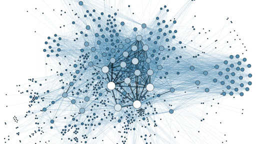
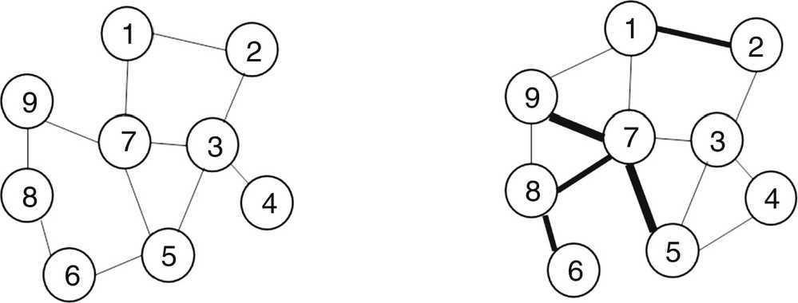
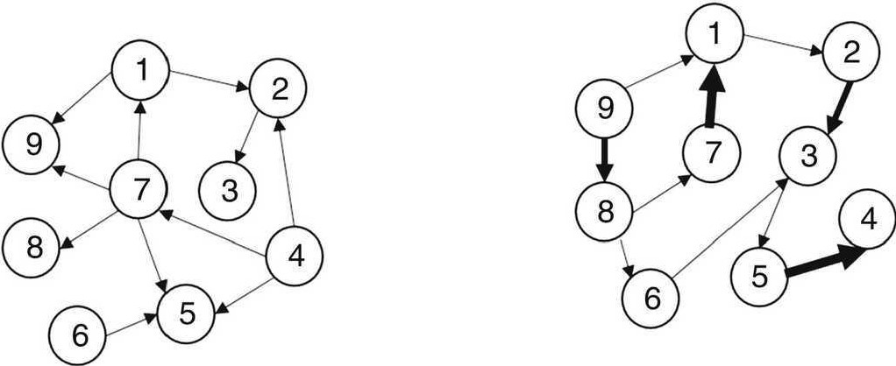
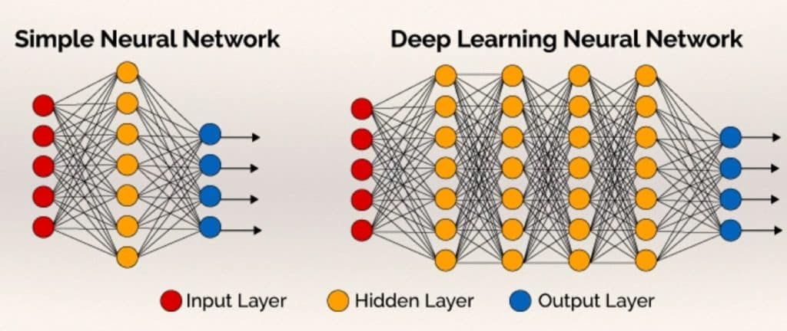
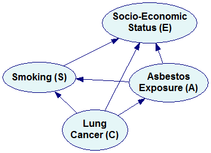
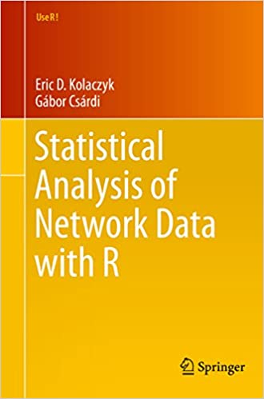
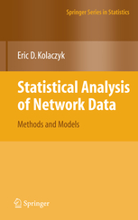
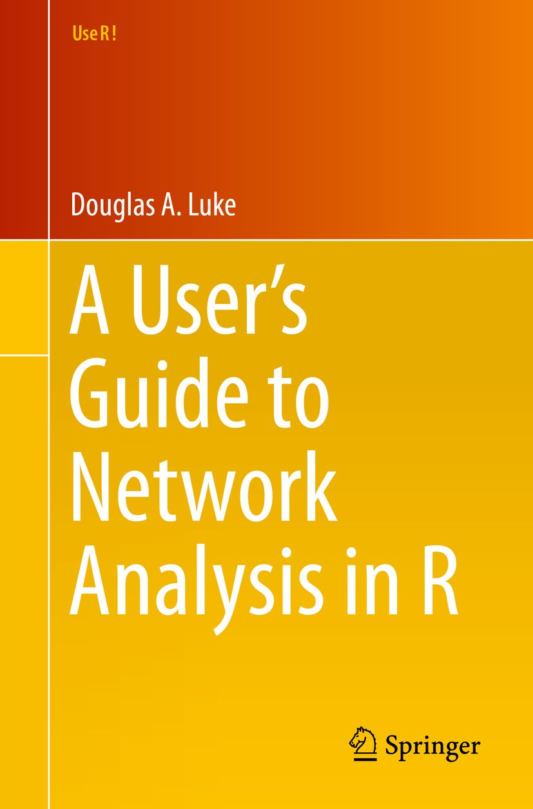

```{r setup, include=FALSE}
knitr::opts_chunk$set(echo = TRUE)
```

# Redes sociales

Una **red** es una colección de objetos interconectados.

Un **grafo** es una colección de objetos (vértices o nodos) unidos por enlaces (aristas o arcos), que permiten representar relaciones entre los elementos del conjunto.

Una **relación** es una propiedad irreductible entre dos o más objetos. Los **atributos** hacen referencia a las características de los objetos en si mismos.

Los **objetos** se se denominan comúnmente como actores, individuos, nodos, o vértices; mientras que las **relaciones** entre ellos como enlaces, conexiones, aristas, o arcos.

Algunos ejemplos:

- Redes de información (e.g., *World Wide Web*).
- Redes de transporte (e.g., red global de aerolineas).
- Redes sociales *on-line* (e.g., *Facebook*).
- Redes laborales (e.g., rede de colaboración).
- Redes biológicas (e.g., red de proteinas).

Las **interacciones** de las partes que constituyen un sistema conducen a **comportamientos colectivos** y **propiedades a nivel global**.

```{r, eval = TRUE, echo=FALSE, out.width="60%", fig.pos = 'H', fig.align = 'center'}

```

# Datos relacionales

Los **datos relacionales** están constituidos por una colección de **objetos**, sus **atributos**, y un conjunto de **relaciones** observadas entre ellos.

La presencia de **variables diádicas**, medidas sobre pares de individuos (díadas), es la característica distintiva de los datos relacionales.

# Objetivos

Estudiar **teoría** y **metodología** para almacenar, gestionar, caracterizar, visualizar, y modelar datos relacionales.

Usar **herramientas computacionales** para hacer análisis estadístico de datos relacionales.

# Tipos de relaciones

## No dirigidas y dirigidas

Una relación **no dirigida** (simétrica) tiene uno y solo un valor por díada. Por otro lado, una relación **dirigida** (asimétrica) tiene dos valores por díada, un valor que representa la perspectiva de cada miembro de la pareja. 

Se dice que una red es una **red no dirigida** si todas las relaciones en ella no están dirigidas, y se denomina **red dirigida** o **dígrafo** en caso contrario.

Ejemplos de relaciones **no dirigidas**:

- Amistades de una red social *on-line*.
- Cantidad de tiempo que personas pasan juntas.

```{r, eval = TRUE, echo=FALSE, out.width="40%", fig.pos = 'H', fig.align = 'center'}

```

Ejemplos de relaciones **dirigidas**:

- Amistades auto-informadas.
- Número de correos electrónicos enviados entre compañeros de trabajo.

```{r, eval = TRUE, echo=FALSE, out.width="40%", fig.pos = 'H', fig.align = 'center'}

```

## Binarias y ponderadas

Una relación **binaria** (dicotómica) únicamente asume dos valores, ausencia o presencia de la relación. Mientras que una relación **ponderada** (numérica) toma más de dos valores para caracterizar las relaciones entre las díadas.

Ejemplos de relaciones **binarias**:

- Presencia de un conflicto militar entre países.
- Presencia de una alianza estratégica entre compañías. 

Ejemplos de relaciones **ponderadas**:

- Número de veces que congresistas apoyan un proyecto de ley juntos.
- Distancia geográfica entre ciudades.

# Fuentes de datos

- https://sites.duke.edu/dnac/resources/datasets/
- https://snap.stanford.edu/
- https://github.com/awesomedata/awesome-public-datasets#socialnetworks
- http://www-personal.umich.edu/~mejn/netdata/
- https://linqs.soe.ucsc.edu/data
- https://kateto.net/2016/05/network-datasets/

# Otros tipos de redes

## Redes neuronales

Una **red neuronal** es un **modelo computacional** con varias **capas de nodos** conectados, cuyo comportamiento está determinado por la forma en que se conectan los nodos así como por la ponderación de las conexiones. Usualmente se utilizan para tareas de identificación complejas, como el reconocimiento facial, la traducción de textos, y el reconocimiento de voz.

```{r, eval = TRUE, echo=FALSE, out.width="50%", fig.pos = 'H', fig.align = 'center'}

```

Ver por ejemplo, Ghatak, A. (2019). *Deep learning with R*. Springer.

**¿Pero qué "es" una Red neuronal?** (3Blue1Brown): https://www.youtube.com/watch?v=aircAruvnKk&t=21s&ab_channel=3Blue1Brown

## Redes Bayesianas
            
Las **redes Bayesianas** son una clase de **modelos gráficos** que permiten una representación de las **dependencias probabilísticas** entre un conjunto dado de variables aleatorias por medio de un *gráfico acíclico dirigido* (DAG), donde cada nodo corresponde a una variable aleatoria.

```{r, eval = TRUE, echo=FALSE, out.width="33%", fig.pos = 'H', fig.align = 'center'}

```

Ver por ejemplo, Scutari, M., & Denis, J. B. (2021). *Bayesian networks: with examples in R*. CRC press.

***Bayesian Networks*** (Bert Huang): https://www.youtube.com/watch?v=TuGDMj43ehw&ab_channel=BertHuang

# Referencias

```{r, eval = TRUE, echo=FALSE, out.width="25%", fig.pos = 'H', fig.align = 'center'}

```

```{r, eval = TRUE, echo=FALSE, out.width="25%", fig.pos = 'H', fig.align = 'center'}

```

```{r, eval = TRUE, echo=FALSE, out.width="25%", fig.pos = 'H', fig.align = 'center'}

```
