```{r setup, include=FALSE}
knitr::opts_chunk$set(echo = TRUE)
```

# Introducción

Conformación y almacenamiento de datos asociados con **datos relacionales**.

- Variables **diádicas**.
- Variables **nodales**.
- Variables **derivadas** (e.g., indicadoras de grupos).

Un **grafo** por sí solo (i.e., una colección de vértices y aristas) suele ser insuficiente como representación de una red.

La noción de **decoración** corresponde a la eventual **conjunción de vértices y aristas con otras variables** de interés (atributos).

Los conceptos y las propiedades fundamentales de la **teoría de grafos** son fundamentales.

# Software

La librería `igraph` proporciona herramientas versátiles para la visualización y el análisis de redes en R, Python y C/C++. 

- https://igraph.org/
- https://kateto.net/networks-r-igraph          
- https://towardsdatascience.com/network-analysis-in-r-manipulating-network-data-ee388fba7215
- https://github.com/kolaczyk/sand

Otras alternativa populares incluyen las librerías:

- `tidygraph`.
- `network`.
- `ggnet2`.
- `ggraph`.
- `networkD3`.
- `NetworkX` (Python).

# Grafos

Un **grafo** $G = (V, E)$ es una estructura que consiste de un conjunto de **vértices** (nodos) $V$ y de un conjunto de **aristas** (enlaces) $E$, donde los elementos de $E$ son parejas de la forma $e=\{u,v\}$, con $u,v\in V$. 

El **número de vértices** y el **número de aristas** se conocen como el **orden** y el **tamaño** del grafo, respectivamente.

Los **vértices** del grafo **se enumeran** con los números enteros: $1,\ldots,n$ o $0,\ldots,n-1$, con $n = |V|$.

## Digrafos

Un grafo para el que cada arista $\{u,v\}\in E$ es tal que $\{u,v\} \not\equiv \{v,u\}$ para todo $u,v\in V$ se denomina **grafo dirigido** o **digrafo**. De lo contrario se llama grafo **no dirigido**. Por defecto, el término **grafo** hace referencia a un **grafo no dirigido**.

```{r, eval = TRUE, echo=FALSE, out.width="40%", fig.pos = 'H', fig.align = 'center'}
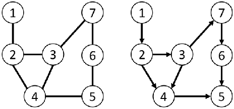
```

# Multigrafos

Un **multigrafo** es aquel que permite **múltiples aristas** entre el mismo par de vértices y aristas de un vértice a sí mismo. 

Un grafo que no es un multigrafo se llama **grafo simple**.

```{r, eval = TRUE, echo=FALSE, out.width="70%", fig.pos = 'H', fig.align = 'center'}
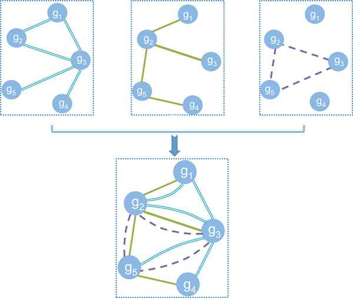
```

## Ejemplo: red no dirigida

```{r}
# install.packages("igraph")
suppressMessages(suppressWarnings(library(igraph)))
# red no dirigida (definicion manual)
g <- graph_from_literal(1-2, 1-3, 2-3, 2-4, 3-5, 4-5, 4-6, 4-7, 5-6, 6-7)
# otra manera
# g <- graph(edges = c(1,2, 1,3, 2,3, 2,4, 3,5, 4,5, 4,6, 4,7, 5,6, 6,7), directed = FALSE)
# clase de objeto
class(g)
# identificador
graph_id(g)
# vertices
V(g)
# orden
vcount(g)
# aristas
E(g)
# tamaño
ecount(g)
# aristas (otro formato)
print_all(g)
# ponderada?
is_weighted(g)
# simple?
is_simple(g)
```

```{r, fig.height = 7, fig.width = 7, fig.align='center'}
# visualizacion
set.seed(42)
plot(g)
```

```{r}
# red ponderada
wg <- g
E(wg)$weight <- round(runif(n = ecount(wg)), 3)
# pesos
E(wg)$weight
# ponderada?
is_weighted(wg)
```

## Ejemplo: red dirigida

```{r}
# red dirigida (definicion manual)
dg <- graph_from_literal(1-+2, 1-+3, 2++3)
# aristas
E(dg)
# cambio de etiquetas
V(dg)$name <- c("Juan", "Maria", "Pedro")
# agregar atributos
V(dg)$genero <- c("M","F","M")
# aristas
E(dg)
```

```{r, fig.height = 7, fig.width = 7, fig.align='center'}
# visualizacion
set.seed(42)
plot(dg, vertex.size = 30)
```

## Ejemplo: multigrafo

```{r}
# multigrafo
mg <- g + edge(c(2,3), c(5,6))
print_all(mg)
# simple?
is_simple(mg)
# simplificacion a grafo ponderado
E(mg)$weight <- 1
wg2 <- simplify(mg)
print_all(wg2)
# simple?
is_simple(wg2)
# aristas
E(wg2)
# pesos
E(wg2)$weight
```

# Estructuras de datos relacionales

Generalmente los grafos **no se definen manualmente** ya que la mayoría de las redes en la práctica son ***grandes***.

Los datos para construir un grafo comúnmente se almacenarán en un **archivo de datos**. 

## Matriz de adyacencia

La **matriz de adyacencia** $\mathbf{Y} = [y_{i,j}]$ asociada con un **grafo binario** $G=(V,E)$ con $n$ vértices es una **matriz binaria** de $n\times n$ tal que $y_{i,j} = 1$ si $\{i,j\} \in E$ y $y_{i,j} = 0$ en otro caso.

La **diagonal principal** de una matriz de adyacencia está llena de **ceros estructurales**.

La matriz de adyacencia de un **grafo no dirigido** es **necesariamente simétrica**. 

La matriz de adyacencia de un **grafo dirigido** es **posiblemente asimétrica**.

```{r, fig.align='center'}
# red no dirigida (definicion manual)
g <- graph_from_literal(1-2, 1-3, 2-3, 2-4, 3-5, 4-5, 4-6, 4-7, 5-6, 6-7)
# visualizacion
set.seed(42)
plot(g)
# matriz de adyacencia
A <- get.adjacency(g)
class(A)
A
# formato matrix array
Y <- get.adjacency(g, sparse = F)
class(Y)
isSymmetric(Y)
Y
# version vectorizada completa
y <- Y[lower.tri(Y)]
class(y)
length(y)
y
# version vectorizada indexada
yy <- which(y == 1)
class(yy)
length(yy)
yy
```

## Matriz de aristas

Una **matriz de aristas** es un **arreglo de dos columnas** conformado por todos los **pares de vértices** que están **unidos** por una arista.

¿Y los **vértices aislados**?

```{r}
# matriz de aristas
n <- dim(Y)[1]
A <- NULL
for (i in 1:(n-1)) 
  for (j in (i+1):n) 
    if (Y[i,j] == 1) 
      A <- rbind(A, c(i,j))
class(A)
A
```

## Ejemplo: Lazega

Red de **relaciones de trabajo colaborativo** entre miembros de una firma de abogados (SG&R). 

Un enlace indica que los miembros de la firma han trabajado juntos en al menos un caso. Es decir, $y_{i,j} = 1$ si los miembros de la firma $i$ y $j$ han trabajado juntos en al menos un caso, y $y_{i,j} = 0$ en otro caso.

Estos datos fueron recolectados con el propósito de **estudiar la cooperación** entre los actores sociales de una organización. 

***Lazega, E. (2001). The collegial phenomenon: The social mechanisms of cooperation among peers in a corporate law partnership. Oxford University Press on Demand.***

Disponible en el paquete `sand` de R, entre otros.

https://www.stats.ox.ac.uk/~snijders/siena/Lazega_lawyers_data.htm

```{r}
# install.packages("sand")
suppressMessages(suppressWarnings(library(sand)))
# datos
class(elist.lazega)
head(elist.lazega)
# atributos (ver ayuda de sand)
# seniority
# status (1 = partner; 2 = associate)
# gender (1 = man; 2 = woman)
# office (1 = Boston; 2 = Hartford; 3 = Providence)
# years with the firm
# age
# practice (1 = litigation; 2 = corporate)
# law school (1= harvard, yale; 2 = ucon; 3 = other)
class(v.attr.lazega)
head(v.attr.lazega)
# grafo
g_lazega <- graph_from_data_frame(d = elist.lazega, directed = "F", vertices = v.attr.lazega)
# ver tambien
# graph_from_edgelist
# graph_from_adjacency_matrix
# simple?
is_simple(g_lazega)
# ponderado?
is_weighted(g_lazega)
# orden
vcount(g_lazega)
# tamaño
ecount(g_lazega)
# atributos
vertex_attr_names(g_lazega)
```

```{r, fig.height = 7, fig.width = 7, fig.align='center'}
# grafico
set.seed(42)
plot(g_lazega, vertex.label = NA, vertex.size = 6, edge.color = "black")
title(main = "Lazega")
```

```{r, fig.height = 7, fig.width = 7, fig.align='center'}
# visualizacion
set.seed(42)
plot(g_lazega, vertex.label = NA, vertex.size = 6, edge.color = "black", vertex.color = c("royalblue","orangered")[v.attr.lazega$Practice])
title(main = "Lazega")
```


# Conceptos fundamentales de la teoría de grafos

## Subgrafo

Un grafo $G'=(V',E')$ es un **subgrafo** de $G=(V,E)$ si $V'\subset V$ y $E'\subset E$.

```{r, eval = TRUE, echo=FALSE, out.width="70%", fig.pos = 'H', fig.align = 'center'}
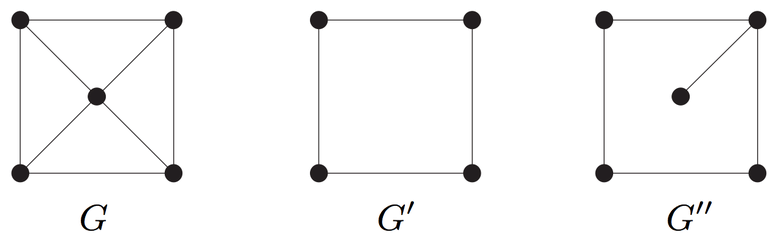
```

## Grafos isomorfos

Dos grafos que son **equivalentes en su estructura** (a pesar de las etiquetas de los vértices) se denominan **isomorfos**. 

```{r, eval = TRUE, echo=FALSE, out.width="70%", fig.pos = 'H', fig.align = 'center'}
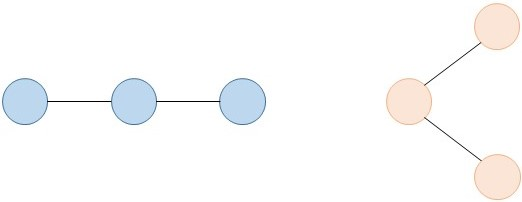
```

Dos grafos $G_1 = (V_1, E_1)$ y $G_2 = (V_2, E_2)$ son **isomorfos**, $G_1 \equiv G_2$, si existe una biyección $\varphi:V_1\longrightarrow V_2$ tal que $\{u,v\}\in E_1$ si y solo si $\{\varphi(u),\varphi(v)\}\in E_2$.

Si $G_1 \equiv G_2$, entonces $|V_1| = |V_2|$ y $|E_1| = |E_2|$.

Si $G_1 \equiv G_2$ y $\{u,v\}\notin E_1$, entonces $\{\varphi(u),\varphi(v)\}\notin E_2$.

## Ejemplo

¿$G_1$ y $G_2$ son isomorfos?

```{r, eval = TRUE, echo=FALSE, out.width="75%", fig.pos = 'H', fig.align = 'center'}
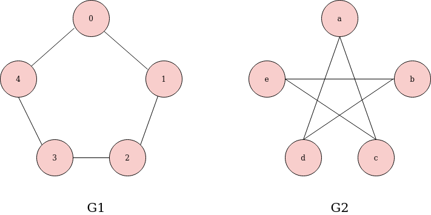
```

## Adyacencia

Se dice que dos vértices $u, v \in V$ son **adyacentes** (vecinos), lo que se denota con $u\sim v$, si $u$ y $v$ están conectados por alguna arista en $E$.

```{r, fig.align='center'}
# red no dirigida (definicion manual)
g <- graph_from_literal(1-2, 1-3, 2-3, 2-4, 3-5, 4-5, 4-6, 4-7, 5-6, 6-7)
# visualizacion
set.seed(42)
plot(g)
# vecinos del vertice 1
neighbors(graph = g, v = 1)
```

Un vértice se llama **asilado** (*isolated*) si no es adyacente a ningún otro nodo (un grafo se puede representar con una matriz de aristas más una lista de vértices aislados). 

Un vértice $v \in V$ es **incidente** (*incident*) en una arista $e \in E$ si $e=\{v,u\}$ para algún $u\in V$. 

El **grado** (*degree*) de un vértice $v$ se define como el número de aristas incidentes en $v$.

```{r}
# grados
degree(g)
```

Para dígrafos, el **grado de entrada** (*in-degree*) y el **grado de salida** (*out-degree*) de un vértice se definen como el número de aristas que apuntan hacia dentro y hacia fuera del vértice, respectivamente.

```{r, fig.align='center'}
# red dirigida (definicion manual)
dg <- graph_from_literal(1-+2, 1-+3, 2++3)
# visualizacion
set.seed(42)
plot(dg)
# grado de entrada
degree(graph = dg, mode = "in")
# grado de salida
degree(graph = dg, mode = "out")
```

## Movimiento

Una **caminata** (*walk*) de $v_0$ a $v_\ell$ es una secuencia alternante $\{v_0,e_1,v_1,e_2,v_2,\ldots,v_{\ell-1},e_\ell,v_\ell\}$ donde los puntos extremos de $e_i$ son $\{v_{i-1}, v_i\}$ para $i=1,\ldots,\ell$. Se dice que la **longitud** de esta caminata es $\ell$. Pueden haber caminatas abiertas o cerradas.

- 1->2->3->4->3    es una caminata abierta. 
- 1->2->3->4->3->1 es una caminata cerrada.

```{r, eval = TRUE, echo=FALSE, out.width="15%", fig.pos = 'H', fig.align = 'center'}
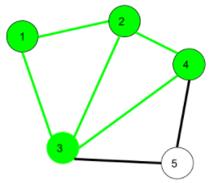
```

Un **sendero** (*trail*) es una caminata abierta sin aristas repetidas (se pueden repetir vértices).

- 1->3->8->6->3->2 es un sendero. 

```{r, eval = TRUE, echo=FALSE, out.width="18%", fig.pos = 'H', fig.align = 'center'}
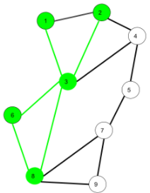
```

Un **circuito** (*circuit*) es una caminata cerrada sin aristas repetidas (se pueden repetir vértices). 

- 1->2->4->3->6->8->3->1 es un circuito.

```{r, eval = TRUE, echo=FALSE, out.width="22%", fig.pos = 'H', fig.align = 'center'}
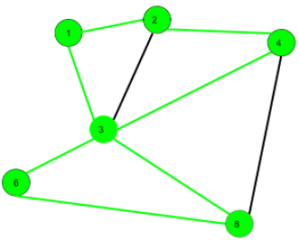
```

Un **ciclo** (*cycle*) es una caminata cerrada con al menos tres aristas no repetidas y vértices intermedios son distintos.

- 1->2->4->3->1 es un ciclo. 

```{r, eval = TRUE, echo=FALSE, out.width="17%", fig.pos = 'H', fig.align = 'center'}
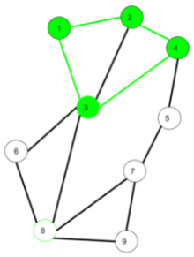
```

Los grafos que no contienen ciclos se denominan **acíclicos** (*acycle*).

Se dice que un vértice $v$ es **accesible** desde otro vértice $u$ si existe una caminata desde $u$ hasta $v$. 

Se dice que un grafo está **conectado** si cada vértice es accesible desde todos los demás. 

Grafos conectados con 5 vértices:

```{r, eval = TRUE, echo=FALSE, out.width="40%", fig.pos = 'H', fig.align = 'center'}
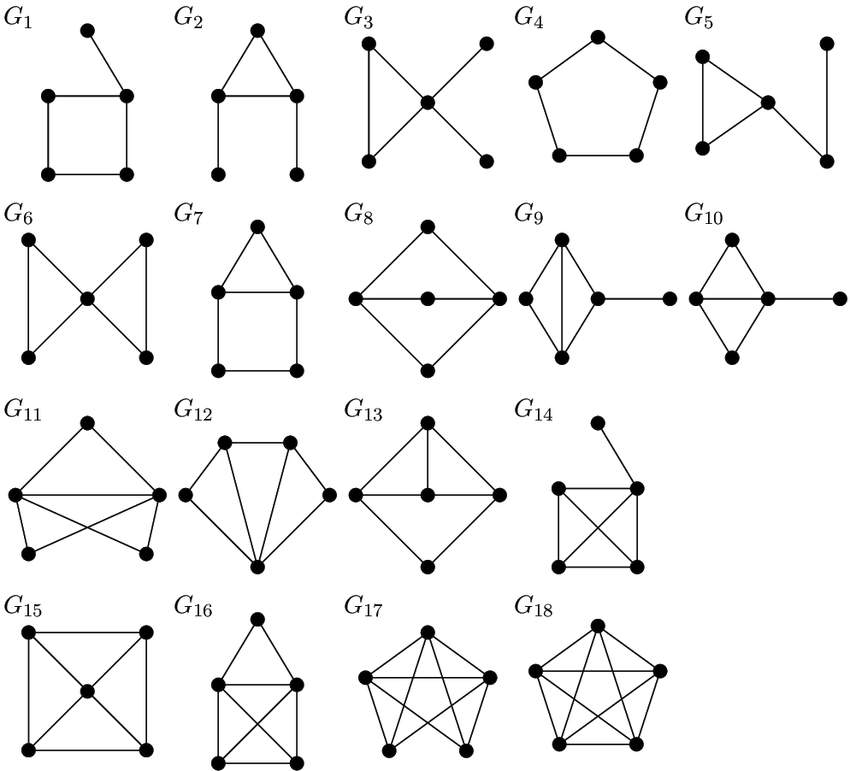
```

Una **componente** de un grafo es un subgrafo conectado maximalmente, i.e., un subgrafo para el cual la adición de cualquier otro vértice arruina la propiedad de conectividad.

Grafo con tres componentes conectadas:

```{r, eval = TRUE, echo=FALSE, out.width="30%", fig.pos = 'H', fig.align = 'center'}
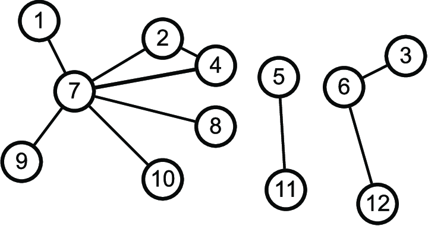
```

```{r, fig.align='center'}
# red no dirigida (definicion manual)
g <- graph_from_literal(1-2, 1-3, 2-3, 2-4, 3-5, 4-5, 4-6, 4-7, 5-6, 6-7)
# visualizacion
set.seed(42)
plot(g)
# conectado?
is_connected(g)
# componentes
clusters(g)
```

Un dígrafo está **conectado débilmente** si el grafo subyacente no dirigido (resultado de remover la direccionalidad) está conectado, y se llama **conectado fuertemente** si cada vértice es accesible desde todos los demás mediante una caminata dirigida.

```{r, fig.align='center'}
# red dirigida (definicion manual)
dg <- graph_from_literal(1-+2, 1-+3, 2++3)
# visualizacion
set.seed(42)
plot(dg)
# conectado debilmente?
is_connected(graph = dg, mode = "weak")
# conectado fuertemente?
is_connected(graph = dg, mode = "strong")
```

## Distancia

La **distancia geodésica** entre dos vértices de un grafo se define como la longitud del camino más corto entre los vértices (se establece igual a infinito si no existen caminos).

El valor de la distancia más grande de un grafo se llama **diámetro** del grafo.

```{r, fig.align='center'}
# red no dirigida (definicion manual)
g <- graph_from_literal(1-2, 1-3, 2-3, 2-4, 3-5, 4-5, 4-6, 4-7, 5-6, 6-7)
# visualizacion
set.seed(42)
plot(g)
```

```{r}
# distancia
distances(graph = g, v = 1, to = 6)
# caminata
shortest_paths(graph = g, from = 1, to = 6)$vpath
```

```{r}
# caminatas
all_shortest_paths(graph = g, from = 1, to = 6)$res
```

```{r}
# distancias
D <- distances(graph = g, v = V(g), to = V(g))
D
```

```{r, fig.align='center'}
# diametro
diameter(g)
max(D[lower.tri(D)])
# sendero
d <- get_diameter(g)
d
# visualizacion del diametro
V(g)$color <- "white"
E(g)$color <- "grey"
E(g)$width <- 1
V(g)[d]$color <- "royalblue"
E(g, path = d)$color <- "royalblue"
E(g, path = d)$width <- 2
set.seed(42)
plot(g, vertex.label = NA,)
```

```{r}
#distancia promedio (grado de separacion)
mean_distance(g)
mean(D[lower.tri(D)])
```

```{r, fig.align='center'}
# distribucion de distancias
distance_table(g)
# visualizacion
senderos = distance_table(g)$res
names(senderos) = 1:length(senderos)
barplot(prop.table(senderos), xlab = "Distancia", ylab = "F. Relativa", border = "grey", col = "grey")
```

# Referencias

```{r, eval = TRUE, echo=FALSE, out.width="25%", fig.pos = 'H', fig.align = 'center'}
knitr::include_graphics("KCbookcover1.jpg")
```

