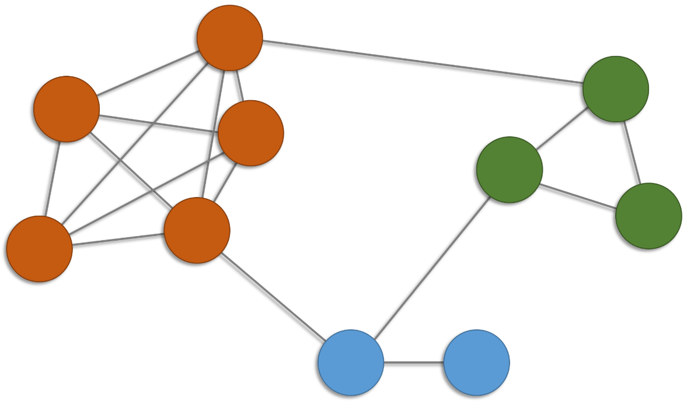
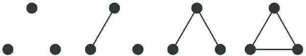
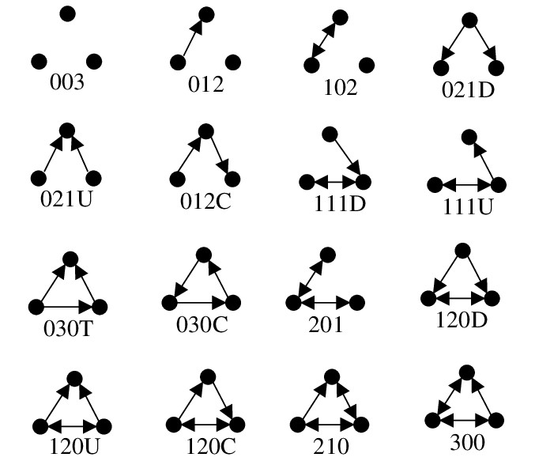
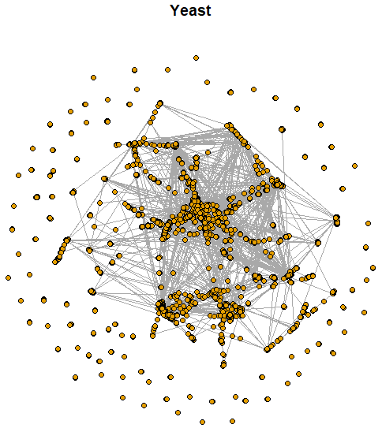

```{r setup, include=FALSE}
knitr::opts_chunk$set(echo = TRUE)
```

# Introducción

La **cohesión** se refiere a la medida en que **subconjuntos de vértices específicos son cohesivos (adherentes)** respecto a la relación que define las aristas.

Hay diversas nociones de cohesión :

- Local.
- Global.
- Explicita.
- Implícita. 

# Subgrafos

Un enfoque para definir la **cohesión de una red** es mediante la **especificación de subgrafos** de interés.

Un **clan** (*clique*) $C$ de un grafo $G=(V,E)$ es un subconjunto de vértices, $C\subset V$, tal que cada par de vértices distintos son adyacente, i.e., el subgrafo de $G$ **inducido** por $C$ es un **grafo completo**. 

Clanes de tamaños más grandes incluyen clanes de tamaños más pequeños. 

```{r, eval = TRUE, echo=FALSE, out.width="30%", fig.pos = 'H', fig.align = 'center'}

```

¿Cuántos clanes?

```{r, fig.align='center'}
suppressMessages(suppressWarnings(library(igraph)))
# datos
g <- graph(edges = c(1,2,1,3,1,4,1,5,2,3,2,4,2,5,3,4,3,5,4,5,6,7,6,8,7,8,9,10,1,6,2,9,7,9), directed = F)
Y <- as.matrix(get.adjacency(graph = g, names = F))
# visualizacion
par(mfrow = c(1,2))
set.seed(42)
plot(g, vertex.size = 20, vertex.color = 0, vertex.label.color = "black", edge.color = "blue4")
corrplot::corrplot(corr = Y, col.lim = c(0,1), method = "color", tl.col = "black", addgrid.col = "gray", cl.pos = "n")
# orden
vcount(g)
# tamaño
ecount(g)
# clan
c1 <- induced_subgraph(graph = g, vids = c(6,7,8))
ecount(c1) == choose(n = vcount(c1), k = 2)
# frecuencias de clanes
table(sapply(X = cliques(graph = g, min = 1, max = 10), FUN = length))
```

Un **clan maximal** (*maximal clique*) es un clan que no se puede extender incluyendo algún otro vértice adyacente.

Un **clan máximo** (*maximum clique*) es un clan que no es subconjunto de un clan más grande.

El **número clan** (*clique number*) de $G$ se define como el tamaño del clan máximo.

En la práctica, **"clanes grandes" son relativamente raros**, ya que requieren que el grafo sea denso, pero las **redes reales tienen a ser dispersas** (*sparse*).


```{r}
# numero clan
clique.number(graph = g)
clique_num(graph = g)
# clanes maximales
maximal.cliques(graph = g)
# clanes maximos
largest.cliques(graph = g)
```


Otras cantidades de interés son las **diadas** y las **triadas**.

¿Cuáles son los estados diádicos no dirigidos y dirigidos? ¿Y los triádicos?

Estados triádicos no dirigidos (*undirected triadic motifs*):

```{r, eval = TRUE, echo=FALSE, out.width="43%", fig.pos = 'H', fig.align = 'center'}

```

Estados triádicos dirigidos (*directed triadic motifs*):

**Davis, J.A. and Leinhardt, S. (1972). The Structure of Positive Interpersonal Relations in Small Groups. In J. Berger (Ed.), Sociological Theories in Progress, Volume 2, 218-251. Boston: Houghton Mifflin.**

```{r, eval = TRUE, echo=FALSE, out.width="58%", fig.pos = 'H', fig.align = 'center'}

```

Un **censo de los estados diádicos** o **triádicos** proporciona una idea razonable de la conectividad de una red.

## Ejemplo: Zachary

Los nodos representan a los **miembros de un club de karate** observado durante un periodo de 2 años.

Los enlaces indican interacciones sociales entre los miembros del club. 

Este conjunto de datos es importante desde un punto de vista científico, dada la fragmentación que sufrió el club en dos clubes diferentes debido a una disputa entre el director y el administrador.

***Zachary, W. W. (1977). An information flow model for conflict and fission in small groups. Journal of anthropological research, 33(4), 452-473.***

Disponible en el paquete `igraphdata` de R.

https://rdrr.io/cran/igraphdata/man/karate.html

https://github.com/igraph/igraphdata

```{r, fig.height = 6, fig.width = 12, fig.align='center'}
# datos
suppressMessages(suppressWarnings(library(sand)))
data(karate)
# visualizacion
par(mfrow = c(1,2))
set.seed(42)
plot(karate, layout = layout_with_kk, vertex.size = 14, vertex.frame.color = "black", vertex.label.color = "black", main = "Zachary")
plot(karate, layout = layout_with_fr, vertex.size = 14, vertex.frame.color = "black", vertex.label.color = "black", main = "Zachary")
par(mfrow = c(1,1))
corrplot::corrplot(corr = as.matrix(get.adjacency(graph = karate, names = F)), col.lim = c(0,1), method = "color", tl.col = "black", addgrid.col = "gray", cl.pos = "n")
```


```{r, fig.height = 6, fig.width = 12}
# orden
vcount(karate)
# tamaño
ecount(karate)
# frecuencias de cliques
table(sapply(X = cliques(graph = g, min = 1, max = 34), FUN = length))
# numero clan
clique.number(graph = karate)
# clanes maximos
largest.cliques(graph = karate)
```

## Ejemplo: Yeast

Las interacciones proteína-proteína prometen revelar aspectos del sistema regulatorio que subyace a la función celular.

Los nodos corresponden a proteínas y solo se consideran aquellas interacciones que tienen una confianza "moderada" y "alta". 

***Von Mering, C., Krause, R., Snel, B., Cornell, M., Oliver, S. G., Fields, S., & Bork, P. (2002). Comparative assessment of large-scale data sets of protein–protein interactions. Nature, 417(6887), 399-403.***

Disponible en el paquete `igraphdata` de R.

http://www.nature.com/nature/journal/v417/n6887/suppinfo/nature750.html

https://github.com/igraph/igraphdata


```{r, eval = TRUE, echo=FALSE, out.width="47%", fig.pos = 'H', fig.align = 'center'}

```

```{r}
suppressMessages(suppressWarnings(library(igraphdata)))
data(yeast)
# orden
vcount(yeast)
# tamaño
ecount(yeast)
# numero clan
clique.number(yeast)
```

El número clan es relativamente pequeño (incluso para redes "grandes").


## Ejemplo: Blogs

Red de **blogs asociados con el SIDA** asociados con los pacientes y sus redes de apoyo. 

Un enlace dirigido de un blog a otro indica que el primero tiene un enlace al segundo en su página web. 

***Miller, H. J. (2007). Societies and cities in the age of instant access. In Societies and cities in the age of instant access (pp. 3-28). Springer, Dordrecht.***

Disponible en el paquete `sand` de R.

https://rdrr.io/cran/sand/man/aidsblog.html


```{r, fig.height = 6, fig.width = 12, fig.align='center'}
# datos
data("aidsblog")
# visualizacion
par(mfrow = c(1,2))
set.seed(42)
plot(aidsblog, layout = layout_with_kk, vertex.size = 5, vertex.label = NA, edge.arrow.size = 0.5, vertex.color = 1, vertex.frame.color = "black", main = "Blogs")
plot(aidsblog, layout = layout_with_fr, vertex.size = 5, vertex.label = NA, edge.arrow.size = 0.5, vertex.color = 1, vertex.frame.color = "black", main = "Blogs")
```

```{r}
# orden
vcount(aidsblog)
# tamaño
ecount(aidsblog)
# simple?
is_simple(aidsblog)
# simplificacion
aidsblog <- simplify(aidsblog)
# censo de estados diadicos
#   mut   The number of pairs with mutual connections.
#   asym  The number of pairs with non-mutual connections.
#   null  The number of pairs with no connection between them.
dyad_census(aidsblog)
# censo de estados triadicos
#   003   A,B,C, the empty graph.
#   012   A->B, C, the graph with a single directed edge.
#   102   A<->B, C, the graph with a mutual connection between two vertices.
#   021D  A<-B->C, the out-star.
#   021U  A->B<-C, the in-star.
#   021C  A->B->C, directed line.
#   111D  A<->B<-C.
#   111U  A<->B->C.
#   030T  A->B<-C, A->C.
#   030C  A<-B<-C, A->C.
#   201   A<->B<->C.
#   120D  A<-B->C, A<->C.
#   120U  A->B<-C, A<->C.
#   120C  A->B->C, A<->C.
#   210   A->B<->C, A<->C.
#   300   A<->B<->C, A<->C, the complete graph.
triad_census(aidsblog)
```
La gran mayoría de los estados son nulos y de los que no lo son, casi todos son asimétricos, lo que indica una marcada unilateralidad en la manera en que los blogs se referencian.


# Densidad

La **densidad** (*density*) de un grafo se define como la frecuencia relativa de las aristas observadas respecto al potencial de aristas.

Para un subgrafo $H=(V_H,E_H)$ del grafo $G=(V,E)$, la densidad se calcula como
$$
\textsf{den(H)}=\frac{|E_H|}{|V_H|(|V_H|-1)/2}\,.
$$
En el caso de un digrafo el denominador debe ser $|V_H|(|V_H|-1)$.

La densidad asume valores entre 0 y 1 y se puede interpretar como una medida de qué tan próximo se encuentra $H$ de ser un clan.

## Ejemplo

```{r, fig.align='center'}
# datos
g <- graph(edges = c(1,2,1,3,1,4,1,5,2,3,2,4,2,5,3,4,3,5,4,5,6,7,6,8,7,8,9,10,1,6,2,9,7,9), directed = F)
Y <- as.matrix(get.adjacency(graph = g, names = F))
# visualizacion
set.seed(42)
plot(g, vertex.size = 20, vertex.color = 0, vertex.label.color = "black", edge.color = "blue4")
# densidad
ecount(g)/(vcount(g)*(vcount(g)-1)/2)
edge_density(graph = g)
mean(Y[lower.tri(Y, diag = F)])
mean(Y[upper.tri(Y, diag = F)])
```
## Ejemplo: Zachary (cont.)

```{r}
# ego network
ego_1  <- induced_subgraph(graph = karate, vids = neighborhood(graph = karate, order = 1, nodes = 1) [[1]])
ego_34 <- induced_subgraph(graph = karate, vids = neighborhood(graph = karate, order = 1, nodes = 34)[[1]])
# densidades
edge_density(graph = karate)
edge_density(graph = ego_1)
edge_density(graph = ego_34)
```

# Transitividad global

Una **tripla** está constituida por tres nodos que están conectados por dos (tripla abierta) o tres (tripla cerrada) de aristas no dirigidas.

La **transitividad** (*transitivity*) de un grafo se cuantifica por medio del **coeficiente de agrupamiento** (*clustering coeffitient*) que se calcula como
$$
\textsf{cl} (G) =\frac{\text{no. triplas cerradas}}{\text{no. triplas}} =\frac{3\times \text{no. triángulos}}{\text{no. triplas}} = \frac{3\tau_\triangle(G)}{\tau_3(G)}\,,
$$
donde $\tau_\triangle(G)$ es el **número de triángulos** en $G$ y $\tau_3(G)$ es el **número de triplas**.

El coeficiente de agrupamiento es una **medida de agrupamiento global** que caracteriza la propensión con la que las triplas forman triángulos.

## Ejemplo

```{r, fig.align='center'}
# datos
h <- graph(edges = c(1,2,1,3,2,3,1,4), directed = F)
# visualizacion
set.seed(42)
plot(h, vertex.size = 20, vertex.color = 0, vertex.label.color = "black", edge.color = "blue4")
# numero de triangulos por vertice
count_triangles(graph = h)
# vertices que son parte de un triangulo
triangles(graph = h)
# conteos de estados triadicos
mot <- motifs(graph = h, size = 3)
mot
# transitividad
3*mot[4]/(mot[3] + 3*mot[4])
transitivity(graph = h, type = "global")
```

## Ejemplo

```{r, fig.align='center'}
# datos
g <- graph(edges = c(1,2,1,3,1,4,1,5,2,3,2,4,2,5,3,4,3,5,4,5,6,7,6,8,7,8,9,10,1,6,2,9,7,9), directed = F)
# visualizacion
set.seed(42)
plot(g, vertex.size = 20, vertex.color = 0, vertex.label.color = "black", edge.color = "blue4")
# numero de triangulos por vertice
count_triangles(graph = g)
# vertices que son parte de un triangulo
sort(triangles(graph = g))
# conteos de estados triadicos
mot <- motifs(graph = g, size = 3)
mot
# transitividad global
3*mot[4]/(mot[3] + 3*mot[4])
transitivity(graph = g, type = "global")
```

# Transitividad local

El **coeficiente de agrupamiento** del vértice $v\in V$ se define teniendo en cuenta la incidencia de $v$ en las aristas que conforman las triplas:
$$
\textsf{cl}(v) = \frac{\text{no. triplas cerradas que incluyen a $v$}}{k_v(k_v-1)/2}\,,
$$
donde $k_v$ es el grado del nodo $v$.

El coeficiente de agrupamiento de un vértice es una **medida de agrupamiento local** que cuantifica qué tan cerca están los vecinos del vértice de ser un clan.

Alternativamente, el  **coeficiente de agrupamiento global** también se puede definir como el promedio de los coeficientes de agrupamiento locales de todos los vértices:
$$
\textsf{cl} (G) = \frac{1}{|V|}\sum_{v\in V} \textsf{cl}(v)\,.
$$

## Ejemplo

```{r}
# datos
g <- graph(edges = c(1,2,1,3,1,4,1,5,2,3,2,4,2,5,3,4,3,5,4,5,6,7,6,8,7,8,9,10,1,6,2,9,7,9), directed = F)
# visualizacion
set.seed(42)
plot(g, vertex.size = 20, vertex.color = 0, vertex.label.color = "black", edge.color = "blue4")
# transividad local del vertice 1
count_triangles(graph = g)
degree(graph = g)
6/(5*(5-1)/2)
transitivity(graph = g, type = "local")
# transitividad global alternativa
mean(transitivity(graph = g, type = "local", vids = V(g)), na.rm = T)
```

## Ejemplo: Zachary (cont.)

```{r}
# transitividad
transitivity(graph = karate, type = "global")
# transividad local
transitivity(karate, type = "local", vids = c(1,34))
```


# Reciprocidad

Un concepto exclusivo de los dígrafos es la **reciprocidad**, i.e., la tendencia con la que hay reciprocidad entre las aristas que conforman la red. Las frecuencias se pueden calcular respecto al número de díadas o de aristas:
$$
\textsf{rec}(G) = \frac{\text{no. aristas reciprocas}}{\text{no. aristas}}\,,
$$
o alternativamente,
$$
\textsf{rec}(G) = \frac{\text{no. diadas reciprocas}}{\text{no. diadas no reciprocas}}\,.
$$

## Ejemplo: Blogs (cont.)

```{r}
# reciprocidad (aristas)
reciprocity(aidsblog, mode = "default")
# reciprocidad (diadas)
reciprocity(aidsblog, mode = "ratio")
```


# Conectividad

Frecuentemente uno de los componentes conectados en un grafo $G=(V,E)$ domina a los demás en magnitud. Tal componente se denomina **componente gigante** (*giant component*).

En la práctica, la atención se restringe al componente gigante para llevar a cabo más análisis y modelamiento.

Un grafo $G=(V,E)$ se llama **$k$-conectado** (*$k$-connected*) si $|V|>k$ y la remoción de cualquier subconjunto de vértices $X \subset V$ tal que $|X| < k$ da como resultado un subgrafo que continua estando conectado.

La **conectividad nodal** de un grafo $G=(V,E)$ corresponde al entero más grande $k$ tal que $G$ es $k$-conectado. Alternativamente, también se puede definir como el número mínimo de nodos que deben eliminarse para desconectar el grafo.

Un vértice que la ser removido desconecta el grafo se denomina **vértice de corte** (*cur vertex*) o **punto de articulación** (*articulation point*). 

La identificación de tales vértices puede proporcionar una idea de dónde es vulnerable una red.

## Ejemplo

```{r}
# datos
f <- graph(edges = c(1,2,1,3,2,3,1,4,4,5), directed = F)
# visualizacion
set.seed(42)
plot(f, vertex.size = 20, vertex.color = 0, vertex.label.color = "black", edge.color = "blue4")
# red conectada?
is_connected(f)
# k-conectividad
vertex_connectivity(f)
edge_connectivity(f)
# puntos de articulacion
articulation_points(f)
```


## Ejemplo: Yeast (cont.)

```{r}
# red conectada?
is_connected(yeast)
# componentes
componentes <- decompose(yeast)
length(componentes)
table(sapply(X = componentes, FUN = vcount))
# tamaño de la componte gigante
max(sapply(X = componentes, FUN = vcount))
max(sapply(X = componentes, FUN = vcount))/vcount(yeast)
# componente gigante
yeast_gc <- decompose(yeast)[[1]]
# vertice-conectividad
vertex_connectivity(yeast_gc)
# arista-conectividad
edge_connectivity(yeast_gc)
# puntos de articulacion
yeast_cv <- articulation_points(yeast_gc)
length(yeast_cv)
length(yeast_cv)/vcount(yeast_gc)
```

Se requiere la eliminación de un solo vértice o una sola arista para dividir el componente gigante en componentes adicionales.

Aproximadamente 15\% de los vértices son puntos de articulación.

# Referencias

```{r, eval = TRUE, echo=FALSE, out.width="25%", fig.pos = 'H', fig.align = 'center'}
knitr::include_graphics("KCbookcover1.jpg")
```