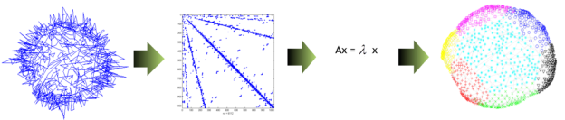
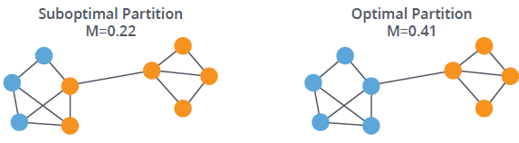
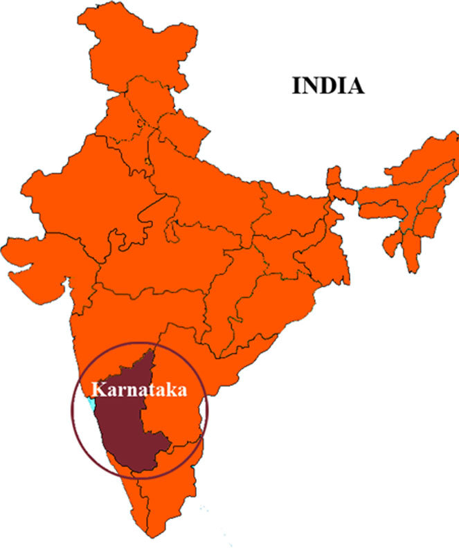

```{r setup, include=FALSE}
knitr::opts_chunk$set(echo = TRUE)
```

# Introducción

El **agrupamiento** (*clustering*/*partitioning*) se refiere a la **segmentación** de un conjunto de elementos en **subconjuntos "naturales"**.

Una **partición** $\mathcal{C}$ de un conjunto finito $S$ se refiere a una **descomposición** de $S$ en $K$ subconjuntos $C_1,\ldots,C_K$ de $S$ tales que:
$$
C_k\neq\Phi\,,\qquad C_k\cap C_\ell = \Phi\,,\qquad \cup_{k=1}^K C_k = S\,,
$$
para $k,\ell\in\{1,\ldots,K\}$ con $k\neq \ell$.

```{r, eval = TRUE, echo=FALSE, out.width="40%", fig.pos = 'H', fig.align = 'center'}
knitr::include_graphics("partition.png")
```

La **partición de redes** (*network partitioning*) también conocida como **detección de comunidades** (*commuty detection*), constituye una **metodología no supervisada** para encontrar **subconjuntos de vértices "homogéneos"** respeto a sus patrones relacionales.

Los **algoritmos de agrupamiento** de grafos buscan una **partición** $\mathcal{C}=\{C_1,\ldots,C_K\}$ del **conjunto de vértices** $V$ de un grafo $G=(V,E)$ tal que el conjunto de aristas conectando vértices de $C_k$ con vértices de $C_{\ell}$ sea relativamente "pequeño" comparado con el conjunto de aristas conectando vértices en $C_k$. 

```{r, eval = TRUE, echo=FALSE, out.width="40%", fig.pos = 'H', fig.align = 'center'}
knitr::include_graphics("clustering_ex.png")
```


Los métodos que se discuten a continuación son **algorítmicos** y  **no constituyen modelos estadísticos**, y por lo tanto, **no permiten cuantificar la incertidumbre** asociada con tanto con la detección de las comunidades como la formación de enlaces.

# Agrupación jerárquica

Estos métodos adoptan un **enfoque computacional intensivo** para explorar el espacio de todas las posibles particiones, **modificando iterativamente** las particiones candidatas.

Los métodos difieren principalmente en la **métrica para evaluar la calidad** de las agrupaciones y los **algoritmos para optimizar tal métrica**.

- **Agrupamiento aglomerativos** (*agglomerative clustering*): ampliación de las comunidades a través de **fusión** (*merging*).
- **Agrupamiento divisivos** (*divisive clustering*): refinamiento de las comunidades a través de **división** (*spliting*).

```{r, eval = TRUE, echo=FALSE, out.width="75%", fig.pos = 'H', fig.align = 'center'}
knitr::include_graphics("clustering_agg_div.png")
```

En cada etapa del algoritmo, la **partición actual** se modifica de manera que se **minimice una función de perdida** específica mediante la **acción menos costosa** de fusión/división.

La función de perdida debe reflejar la **noción de subconjuntos "cohesivos" de vértices**. 

***M. Newman and M. Girvan, "Finding and evaluating community structure in networks", Physical Review E, vol. 69, no. 2, p. 26113, 2004.***.

https://arxiv.org/pdf/cond-mat/0308217.pdf

Una función de perdida es la **modularidad** (*modularity*), que para una partición $\mathcal{C}=\{C_1,\ldots,C_K\}$ se define como:
$$
\textsf{mod}(\mathcal{C}) = \sum_{k=1}^K (e_{k,k} - f_{k,k}^2)\,,
$$
donde:

- $f_{k,\ell}$: fracción de enlaces en la red que conectan los vértices de $C_k$ con los vértices de $C_\ell$.
- $e_{k,\ell}$: valor esperado de $f_{k,\ell}$ bajo un **modelo de asignación** de aristas en el que las aristas se forman sin tener en cuenta las comunidades a las que pertenecen los vértices, i.e., $e_{k,\ell}=f_{k\bullet}f_{\bullet\ell}$ donde $f_{k\bullet}=\sum_{\ell=1}^Kf_{k,\ell}$ y $f_{\bullet\ell}=\sum_{k=1}^K f_{k,\ell}$ (para redes no dirigidas se tiene que $f_{k\bullet} = f_{\bullet\ell}$)

Un valor "grande" de la modularidad indica que $\mathcal{C}$ corresponde a una partición que difiere sustancialmente de lo esperado bajo el modelo de asignación de aristas bajo consideración.

`cluster_fast_greedy` en `igraph`.

# Particionamiento espectral

La **matriz de modularidad** (*modularity matrix*) de un grafo $G=(V,E)$ con matriz de adyacencia $\mathbf{Y}$ corresponde a la matriz $\mathbf{A} = \mathbf{Y} - \mathbf{P}$, donde $\mathbf{P}$ contiene las probabilidades de interacción en una red aleatoria en la que los grados de todos los vértices son iguales que en $G$.

***M. Newman, "Finding community structure using the eigenvectors of matrices", Physical Review E, vol. 74, no. 3, p. 036104, 2006.***

https://arxiv.org/pdf/physics/0605087.pdf

El método funciona calculando el vector propio de la matriz de modularidad para el valor propio positivo más grande y luego separando los vértices en dos comunidades según el signo del elemento correspondiente en el vector propio. Si todos los elementos del vector propio tienen el mismo signo, eso significa que la red no tiene una estructura comunitaria subyacente.

```{r, eval = TRUE, echo=FALSE, out.width="100%", fig.pos = 'H', fig.align = 'center'}

```

`cluster_leading_eigen` en `igraph`.

# Resumen

| Algoritmo | Función en `igraph`  | Idea  |
|:---------:|:--------------------:|:-----:|
| Fast-greedy | `cluster_fast_greedy` | Optimizar una métrica de modularidad |
| Edge-betweenness | `cluster_edge_betweenness` | Optimizar una métrica de aristas basada en caminos más cortos |
| Leading eigenvector | `cluster_leading_eigen` | Calcular el vector propio principal no negativo de la matriz de modularidad |
| Louvain | `cluster_louvain` | Optimizar una métrica de modularidad múltinivel|
| Walktrap | `cluster_walktrap` | Caminatas aleatorias cortas tienden a permanecer en la misma comunidad  |
| Label propagation | `cluster_label_prop` | Etiquetar vértices con etiquetas únicas y actualizarlas por votación mayoritaria en la vecindad del vértice |
| InfoMAP | `cluster_infomap` | Optimizar la longitud esperada de una trayectoria de una caminata aleatoria |
| Spinglass | `cluster_spinglass` | Modelo *spin-glass* y *simulated annealing* |
| Optimal | `cluster_optimal` | Optimizar una métrica de modularidad |

En `igraph`, la **modulariad** (otra acepción) de un grafo respecto a una partición cuantifica **qué tan buena es la división** o **qué tan separados están los diferentes tipos de vértices entre sí**:
$$
\textsf{mod}(\mathcal{C}) = \frac{1}{2m} \sum_{i,j:i\neq j} \left(y_{i,j} - \tfrac{1}{2m}d_id_j\right)\delta_{c_i,c_j}
$$
donde:

- $\mathbf{Y}=[y_{i,j}]$ : matriz de adyacencia.
- $m$ : tamaño del grafo (número de aristas).
- $d_i$ : grado del vértice $i$.
- $c_i$ : grupo de la partición al que pertenece el vértice $i$ (*membership* o *cluster assignment*).
- $\delta_{x,y} = 1$ si $x=y$ y $\delta_{x,y} = 0$ en otro caso.

```{r, eval = TRUE, echo=FALSE, out.width="70%", fig.pos = 'H', fig.align = 'center'}

```

# Validación

Cuando se tiene conocimiento de alguna **noción de pertenencia a una clase definida externamente**, resulta interesante interesante **comparar y contrastar las asignaciones resultantes** con las que se derivan de la partición.

`compare` en `igraph`.

Comparación de dos particiones:

- `rand` : *the Rand index* (Rand 1971).
- `adjusted.rand` : *adjusted Rand index* (Hubert and Arabie 1985).
- `vi` : *variation of information (VI) metric* (Meila 2003).
- `nmi` : *normalized mutual information measure* (Danon et al. 2005).
- `split.join` : *split-join distance* (can Dongen 2000).

Por ejemplo, el **índice Rand** tiene un valor entre 0 y 1, donde 0 indica que las dos agrupaciones de datos no coinciden en ningún par de puntos y 1 indica que las agrupaciones de datos son exactamente iguales:
$$
\textsf{RI}(X,Y) = \frac{a+b}{a+b+c+d}
$$
donde:

- $X$ y $Y$: particiones del conjunto de números enteros $S=\{1,\ldots,n\}$.
- $a$: el número de pares de elementos en $S$ que están en el mismo subconjunto en $X$ y en el mismo subconjunto en $Y$.
- $b$: el número de pares de elementos en $S$ que están en diferentes subconjuntos en $X$ y en diferentes subconjuntos en $Y$.
- $c$: el número de pares de elementos en $S$ que están en el mismo subconjunto en $X$ y en diferentes subconjuntos en $Y$.
- $d$: el número de pares de elementos en $S$ que están en diferentes subconjuntos en $X$ y en el mismo subconjunto en $Y$.

# Ejemplo: Zachary

Los nodos representan a los **miembros de un club de karate** observado durante un periodo de 2 años.

Los enlaces indican interacciones sociales entre los miembros del club. 

Este conjunto de datos es importante desde un punto de vista científico, dada la fragmentación que sufrió el club en dos clubes diferentes debido a una disputa entre el director y el administrador.

***Zachary, W. W. (1977). An information flow model for conflict and fission in small groups. Journal of anthropological research, 33(4), 452-473.***

Disponible en el paquete `igraphdata` de R.

https://rdrr.io/cran/igraphdata/man/karate.html

https://github.com/igraph/igraphdata


```{r, fig.height = 6, fig.width = 12, fig.align='center'}
# datos
suppressMessages(suppressWarnings(library(sand)))
data(karate)
# visualizacion
par(mfrow = c(1,2))
set.seed(42)
l = layout_with_fr(karate)
plot(karate, layout = l, vertex.size = 14, vertex.frame.color = "black", vertex.label.color = "black", main = "Zachary")
corrplot::corrplot(corr = as.matrix(get.adjacency(graph = karate, names = F)), col.lim = c(0,1), method = "color", tl.col = "black", addgrid.col = "gray", cl.pos = "n")
```


```{r, fig.height = 6, fig.width = 12, fig.align='center'}
# orden
vcount(karate)
# tamaño
ecount(karate)
# dirigida?
is_directed(karate)
# ponderada?
is_weighted(karate)
# aplicacion del algoritmo
kc <- igraph::cluster_fast_greedy(karate)
# estructura
str(kc)
# algoritmo
kc$algorithm
# algoritmo jerarquico?
is_hierarchical(kc)
# asignaciones
kc$membership
# tamaños
sizes(kc)
table(kc$membership)
# tamaño de la particion
length(kc)
length(table(kc$membership))
# grafico
par(mfrow = c(1,2))
set.seed(1)
plot(x = kc, y = karate, vertex.size = 12)
set.seed(1)
plot(x = kc, y = karate, mark.groups = NULL, edge.color = "darkgray", vertex.size = 12)
```


```{r, fig.height = 6, fig.width = 12, fig.align='center'}
# grafico
par(mfrow = c(1,2))
plot(karate, layout = l, vertex.size = 12, vertex.frame.color = "black", vertex.label.color = "black")
plot(karate, layout = l, vertex.size = 12, vertex.frame.color = "black", vertex.label.color = "black", vertex.color = kc$membership)
```


```{r, fig.height=6, fig.width=12, fig.align='center'}
# funciones
get_adjacency_ordered <- function(xi, A) 
{
  xi2 <- xi[order(xi)]
  indices <- order(xi)
  d <- NULL
  for (i in 1:(length(xi)-1)) if (xi2[i] != xi2[i+1]) d <- c(d, i)
  list(A = A[indices,indices], d = d)
}
#
heat.plot0 <- function (mat, show.grid = FALSE, cex.axis, tick, labs, col.axis, ...)
{ 
  JJ <- dim(mat)[1]
  colorscale <- c("white", rev(heat.colors(100)))
  if(missing(labs))     labs <- 1:JJ
  if(missing(col.axis)) col.axis <- rep("black", JJ)
  if(missing(cex.axis)) cex.axis <- 1
  if(missing(tick))     tick <- TRUE
  ## adjacency matrix
  image(seq(1, JJ), seq(1, JJ), mat, axes = FALSE, xlab = "", ylab = "", col = colorscale[seq(floor(100*min(mat)), floor(100*max(mat)))], ...)
  for(j in 1:JJ){
    axis(1, at = j, labels = labs[j], las = 2, cex.axis = cex.axis, tick, col.axis = col.axis[j], col.ticks = col.axis[j])
    axis(2, at = j, labels = labs[j], las = 2, cex.axis = cex.axis, tick, col.axis = col.axis[j], col.ticks = col.axis[j])
  }
  box()
  if(show.grid) grid(nx = JJ, ny = JJ)
}
# asignaciones 
xi <- kc$membership
# asignaciones ordenadas 
xi2 <- xi[order(xi)]
# matriz de adyacencia original
Y <- get.adjacency(graph = karate, sparse = F)
# matriz de adyacencia ordenada y lineas divisorias de acuerdo con las comunidades
tmp <- get_adjacency_ordered(xi = xi, A = Y)
A <- tmp$A
d <- tmp$d
# grafico
par(mfrow = c(1,2))
heat.plot0(mat = Y)
heat.plot0(mat = A, col.axis = c("darkgoldenrod3","deepskyblue3","forestgreen")[xi2])
abline(v = d+.5, h = d+.5)
```


```{r, fig.height=6, fig.width=6, fig.align='center'}
plot_dendrogram(x = kc, mode = "phylo")
```


# Ejemplo: Zachary (cont.)

```{r}
# algoritmos
kc_fast_greedy <- cluster_fast_greedy(karate)
kc_leading_eigen <- cluster_leading_eigen(karate)
kc_walktrap <- cluster_walktrap(karate)
kc_louvain <- cluster_louvain(karate)
kc_label_prop <- cluster_label_prop(karate)
kc_spinglass <- cluster_spinglass(karate)
kc_optimal <- cluster_optimal(karate)
kc_infomap <- cluster_infomap(karate)
```


```{r, fig.width=12, fig.height=12, fig.align='center'}
# graficos
igraph_options(vertex.size = 10, vertex.frame.color = "black")
par(mfrow = c(3,3))
plot(karate, vertex.label = NA, layout = l, vertex.color = kc_fast_greedy$membership, main = paste0("fast greedy: ", "Mod = ", round(modularity(kc_fast_greedy), 4)))
plot(karate, vertex.label = NA, layout = l, vertex.color = kc_leading_eigen$membership, main = paste0("leading eigen: ", "Mod = ", round(modularity(kc_leading_eigen), 4)))
plot(karate, vertex.label = NA, layout = l, vertex.color = kc_walktrap$membership, main = paste0("walktrap: ", "Mod = ", round(modularity(kc_walktrap), 4)))
plot(karate, vertex.label = NA, layout = l, vertex.color = kc_louvain$membership, main = paste0("louvain: ", "Mod = ", round(modularity(kc_louvain), 4)))
plot(karate, vertex.label = NA, layout = l, vertex.color = kc_label_prop$membership, main = paste0("label prop: ", "Mod = ", round(modularity(kc_label_prop), 4)))
plot(karate, vertex.label = NA, layout = l, vertex.color = kc_spinglass$membership, main = paste0("spinglass: ", "Mod = ", round(modularity(kc_spinglass), 4)))
plot(karate, vertex.label = NA, layout = l, vertex.color = kc_optimal$membership, main = paste0("optimal: ", "Mod = ", round(modularity(kc_optimal), 4)))
plot(karate, vertex.label = NA, layout = l, vertex.color = kc_infomap$membership, main = paste0("infomap: ", "Mod = ", round(modularity(kc_infomap), 4)))
```

# Ejemplo: Zachary (cont.)


```{r, fig.height = 6, fig.width = 12}
# atributos
data(karate)
fc <- as.numeric(as.factor(vertex_attr(graph = karate, name = "Faction")))
table(fc)
# aplicacion de algoritmos
kc_fast_greedy <- cluster_fast_greedy(karate)
kc_leading_eigen <- cluster_leading_eigen(karate)
```

```{r}
# comparacion
compare(comm1 = fc, comm2 = kc_fast_greedy$membership, method = "rand")
compare(comm1 = fc, comm2 = kc_leading_eigen$membership, method = "rand")
# tablas cruzadas
table(fc, kc_fast_greedy$membership)
table(fc, kc_leading_eigen$membership)
```


# Ejemplo: Karnataca

***Salter-Townshend, M. & McCormick, T. H. (2017), ‘Latent space models for multiview network data’, The Annals of Applied Statistics 11(3), 1217.***

Relaciones sociales y familiares entre hogares en un aldea específica ubicada en la zona rural del sur de Karnataka, India. 

Para estos datos, $y_{i,j} = 1$ si los hogares $i$ y $j$ tienen están relacionados familiarmente o asisten juntos al templo.

```{r, eval = TRUE, echo=FALSE, out.width="40%", fig.pos = 'H', fig.align = 'center'}

```

```{r}
# datos
suppressMessages(suppressWarnings(library(igraph)))
load("salter543_data.RData")
karna <- graph_from_adjacency_matrix(adjmatrix = Ycube, mode = "undirected")
# orden
vcount(karna)
# tamaño
ecount(karna)
# dirigida?
is_directed(karna)
# ponderada?
is_weighted(karna)
# conectada?
is_connected(karna)
# componentes
componentes <- decompose(karna)
sapply(X = componentes, FUN = vcount)
# componente gigante
karna <- componentes[[1]]
# aplicacion de algoritmos
kc_fast_greedy <- igraph::cluster_fast_greedy(karna)
kc_leading_eigen <- cluster_leading_eigen(karna)
```


```{r, fig.width=12, fig.height=6, fig.align='center'}
# visualizacion
par(mfrow = c(1,2))
set.seed(42)
l  <- layout_nicely(karna)
dc <- degree (graph = karna, normalized = T)
igraph_options(vertex.size = 25*sqrt(dc), edge.color = "gray85")
plot(karna, vertex.label = NA, vertex.color = adjustcolor(kc_fast_greedy$membership, 0.3), vertex.frame.color = adjustcolor(kc_fast_greedy$membership, 0.3), main = paste0("fast greedy: ", "Mod = ", round(modularity(kc_fast_greedy), 4)))
plot(karna, vertex.label = NA, vertex.color = adjustcolor(kc_leading_eigen$membership, 0.3), vertex.frame.color = adjustcolor(kc_leading_eigen$membership, 0.3), main = paste0("leading eigen: ", "Mod = ", round(modularity(kc_leading_eigen), 4)))
```


```{r, fig.width=12, fig.height=6}
# matrices de adyacencia
par(mfrow = c(1,2))
# fast greedy
xi <- kc_fast_greedy$membership
tmp <- get_adjacency_ordered(xi = xi, A = Ycube)
A <- tmp$A
d <- tmp$d
heat.plot0(mat = A, labs = NA, tick = F, main = paste0("fast greedy: ", "Mod = ", round(modularity(kc_fast_greedy), 4)))
abline(v = d+.5, h = d+.5)
# leading_eigen
xi <- kc_leading_eigen$membership
tmp <- get_adjacency_ordered(xi = xi, A = Ycube)
A <- tmp$A
d <- tmp$d
heat.plot0(mat = A, labs = NA, tick = F, cex.axis = 0.4, main = paste0("fast greedy: ", "Mod = ", round(modularity(kc_leading_eigen), 4)))
abline(v = d+.5, h = d+.5)
```


# Referencias

```{r, eval = TRUE, echo=FALSE, out.width="25%", fig.pos = 'H', fig.align = 'center'}
knitr::include_graphics("KCbookcover1.jpg")
```