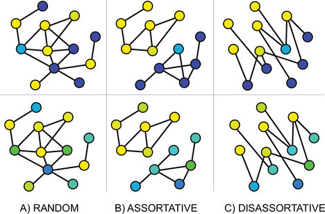
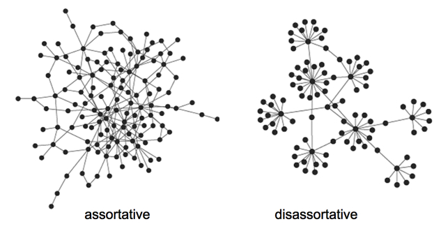
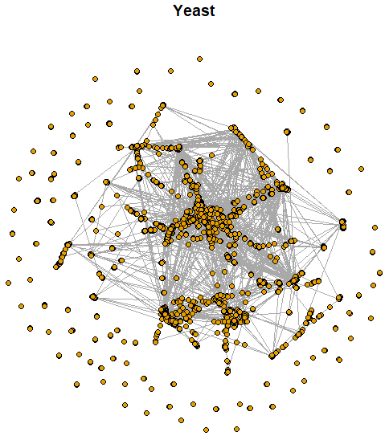

```{r setup, include=FALSE}
knitr::opts_chunk$set(echo = TRUE)
```

# Introducción

La **conexión selectiva** entre vértices de acuerdo con sus características se denomina **mezcla asortativa** (*assortative mixing*).

Los **coeficientes de asortatividad** cuantifican la **mezcla selectiva** de una red.

# Interpretación

Los coeficientes de asortatividad son positivos si los **vértices similares** tienden a conectarse entre ellos, y negativo en caso contrario.

Los coeficientes de asortatividad miden el nivel de **homofilia** (*homophily*) del grafo, basándose en las etiquetas o valores asignados a los vértices. Si el coeficiente es alto, significa que los vértices conectados tienden a tener las mismas etiquetas o valores asignados similares.

La **homofilia** se refiere a que nodos similares tienen a relacionarse entre sí.

```{r, eval = TRUE, echo=FALSE, out.width="40%", fig.pos = 'H', fig.align = 'center'}
knitr::include_graphics("assortatividad_assor.jpg")
```

# Características categóricas

Cada vértice de un grafo $G=(V,E)$ se puede etiquetar de acuerdo con una de $M$ categorías. En este caso, el **coeficiente de asortividad** (*assortativity coefficient*) se define como
$$
r_a = \frac{\sum_{i=1}^n f_{i,i} - \sum_{i=1}^n f_{i\bullet}f_{\bullet i}}{1 - \sum_{i=1}^n f_{i\bullet}f_{\bullet i}}
$$
donde:

- $f_{i,j}$: fracción de aristas que unen un vértice de la $i$-ésima categoría con un vértice de la $j$-ésima categoría.
- $f_{i\bullet} = \sum_{j=1}^n f_{i,j}$.
- $f_{\bullet j} = \sum_{i=1}^n f_{i,j}$.

Propiedades:

- Se tiene que $-1\leq r_a \leq 1$. 
- $r_a=0$ cuando la conexión selectiva no es diferente de la obtenida mediante una asignación aleatoria de aristas que conserva la distribución de los grados. 
- $r_a=1$ cuando hay una conexión selectiva **asortativa perfecta** (i.e., las aristas solo conectan vértices de la misma categoría). 
- $r_a$ no es necesariamente igual a $-1$ cuando hay una conexión selectiva **desasortativa perfecta** (i.e., las aristas solo conectan vértices de categorías diferentes).

Ver `assortativity_nominal` en `igraph`.


```{r, eval = TRUE, echo=FALSE, out.width="75%", fig.pos = 'H', fig.align = 'center'}

```


# Características numéricas

Cuando la característica de interés es continua, se denota con $(x_e, y_e)$ los valores de esa característica para los vértices unidos por la arista $e \in E$. En este caso, el **coeficiente de assortividad** se define como
$$
r_a = \frac{\sum_{e\in E} xy(f_{x,y} - f_{x\bullet}f_{\bullet y})}{\sigma_x \sigma_y}
$$
donde:

- La suma se hace únicamente sobre las aristas observadas $e\in E$.
- Tanto $f_{x,y}$ como $f_{x\bullet}$ y $f_{\bullet y}$ se definen de manera análoga.
- $\sigma_x$ y $\sigma_y$ son las desviaciones estándar asociadas con las distribuciones de frecuencias de $f_{x\bullet}$ y $f_{\bullet y}$, respectivamente.

Comúnmente la característica continua se toma como el **grado**.

Ver `assortativity` y `assortativity_degree` en `igraph`.


```{r, eval = TRUE, echo=FALSE, out.width="80%", fig.pos = 'H', fig.align = 'center'}

```

# Ejemplo: Yeast

Las interacciones proteína-proteína prometen revelar aspectos del sistema regulatorio que subyace a la función celular.

Los nodos corresponden a proteínas y solo se consideran aquellas interacciones que tienen una confianza "moderada" y "alta". 

***Von Mering, C., Krause, R., Snel, B., Cornell, M., Oliver, S. G., Fields, S., & Bork, P. (2002). Comparative assessment of large-scale data sets of protein–protein interactions. Nature, 417(6887), 399-403.***

Disponible en el paquete `igraphdata` de R.

http://www.nature.com/nature/journal/v417/n6887/suppinfo/nature750.html

https://github.com/igraph/igraphdata


```{r, eval = TRUE, echo=FALSE, out.width="47%", fig.pos = 'H', fig.align = 'center'}

```

```{r}
suppressMessages(suppressWarnings(library(igraph)))
# datos
suppressMessages(suppressWarnings(library(igraphdata)))
data(yeast)
# orden
vcount(yeast)
# tamaño
ecount(yeast)
# clases
table(V(yeast)$Class)
sum(table(V(yeast)$Class))
# hay NAs
table(is.na(V(yeast)$Class))
# clase P
# se sabe que desempeñan un papel en la síntesis de proteinas
v.types <- (V(yeast)$Class == "P") + 1
v.types[is.na(v.types)] <- 1
table(v.types)
# asortatividad nominal
assortativity_nominal(graph = yeast, types = v.types, directed = F)
# asortatividad grado
assortativity_degree(yeast)
```

## Ejemplo: Zachary

Los nodos representan a los **miembros de un club de karate** observado durante un periodo de 2 años.

Los enlaces indican interacciones sociales entre los miembros del club. 

Este conjunto de datos es importante desde un punto de vista científico, dada la fragmentación que sufrió el club en dos clubes diferentes debido a una disputa entre el director y el administrador.

***Zachary, W. W. (1977). An information flow model for conflict and fission in small groups. Journal of anthropological research, 33(4), 452-473.***

Disponible en el paquete `igraphdata` de R.

https://rdrr.io/cran/igraphdata/man/karate.html

https://github.com/igraph/igraphdata


```{r, fig.height = 6, fig.width = 6, echo = F, fig.align='center'}
# datos
suppressMessages(suppressWarnings(library(sand)))
data(karate)
# viz 
set.seed(42)
plot(karate, layout = layout_with_fr, vertex.size = 12, vertex.frame.color = "black", vertex.label.color = "black")
title(main = "Zachary")
```


```{r}
# datos
suppressMessages(suppressWarnings(library(sand)))
data(karate)
# orden
vcount(karate)
# tamaño
ecount(karate)
# clase
v.types <- V(karate)$Faction
# asortatividad nominal
assortativity_nominal(graph = karate, types = v.types, directed = F)
# asortatividad grado
assortativity_degree(karate)
```


# Ejemplo: Lazega

Red de **relaciones de trabajo colaborativo** entre miembros de una firma de abogados (SG&R). 

Un enlace indica que los miembros de la firma han trabajado juntos en al menos un caso.

***Lazega, E. (2001). The collegial phenomenon: The social mechanisms of cooperation among peers in a corporate law partnership. Oxford University Press on Demand.***

Disponible en el paquete `sand` de R.

https://www.stats.ox.ac.uk/~snijders/siena/Lazega_lawyers_data.htm


```{r, fig.height = 6, fig.width = 6, echo = F, fig.align='center'}
suppressMessages(suppressWarnings(library(sand)))
data(lazega)
lazega <- graph_from_data_frame(d = elist.lazega, directed = "F")
V(lazega)$label <- sub("V", "", V(lazega)$name)
# viz
set.seed(42)
plot(lazega, layout = layout_with_fr, vertex.size = 12, vertex.frame.color = "black", vertex.label.color = "black")
title(main = "Lazega")
```

```{r}
suppressMessages(suppressWarnings(library(sand)))
data(lazega)
# orden
vcount(lazega)
# tamaño
ecount(lazega)
# asortatividad nominal
assortativity(graph = lazega, types1 = V(lazega)$Office)
assortativity(graph = lazega, types1 = V(lazega)$Practice)
assortativity(graph = lazega, types1 = V(lazega)$School)
# asortativiad continua
assortativity(graph = lazega, types1 = V(lazega)$Years)
assortativity(graph = lazega, types1 = degree(lazega))
# asortatividad grado
assortativity_degree(graph = lazega, directed = F)
```


# Referencias

```{r, eval = TRUE, echo=FALSE, out.width="25%", fig.pos = 'H', fig.align = 'center'}
knitr::include_graphics("KCbookcover1.jpg")
```