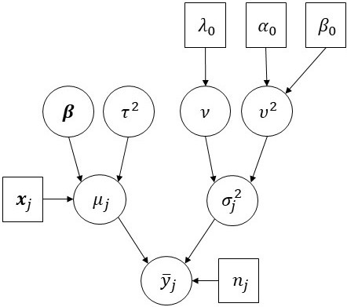

```{r setup, include=FALSE}
knitr::opts_chunk$set(echo = TRUE)
```

# Introducción

El modelo de regresión se ocupa de caracterizar cómo el proceso generativo asociado con una variable aleatoria $y$ varía junto con otra variable o conjunto de variables $\boldsymbol{x} = (x_1,\ldots,x_p)$.
Específicamente, un modelo de regresión especifica una forma para $p (y \mid \boldsymbol{x})$, la distribución condicional de $y$ dado $\boldsymbol{x}$.
La estimación de $p (y \mid \boldsymbol{x})$ se realiza utilizando el vector de observaciones $\boldsymbol{y} = (y_1,\ldots,y_n)$ que se recopilan bajo una variedad de condiciones $\boldsymbol{x}_1,\ldots,\boldsymbol{x}_n$, con $\boldsymbol{x}_i = (x_{i,1},\ldots,x_{i,p})$ para $i=1,\ldots,n$.

Una solución a este problema es asumir que $p (y \mid \boldsymbol{x})$ es una función *suave* de $\boldsymbol{x}$, de modo que los valores de $\boldsymbol{x}$ pueden incidir en el proceso generativo de $y$.
Un **modelo de regresión lineal** es un tipo particular de modelo para $p (y \mid \boldsymbol{x})$, el cual especifica que $\textsf{E} (y \mid \boldsymbol{x})$ tiene una forma lineal en un conjunto de parámetros $\boldsymbol{\beta} = (\beta_1,\ldots,\beta_p)$ como sigue:
$$
\textsf{E} (y \mid \boldsymbol{x}) = \int_{\mathcal{Y}} y\, p (y \mid \boldsymbol{x})\,\text{d}y = \sum_{k=1}^p \beta_k x_k = \boldsymbol{\beta}^{\textsf{T}}\boldsymbol{x}\,.
$$
El **modelo de regresión lineal Normal** especifica que la variabilidad alrededor de $\textsf{E} (y \mid \boldsymbol{x})$ surge por medio de una distribución Normal:
$$
y_i \mid \boldsymbol{x}_i,\boldsymbol{\beta},\sigma^2 \stackrel{\text {iid}}{\sim} \textsf{N}(\boldsymbol{\beta}^{\textsf{T}}\boldsymbol{x}_i,\sigma^2)
\qquad\Longleftrightarrow\qquad
y_i = \boldsymbol{\beta}^{\textsf{T}}\boldsymbol{x}_i + \epsilon_i\,,\quad\epsilon_i\mid\sigma^2\stackrel{\text {iid}}{\sim} \textsf{N}(0,\sigma^2)
$$
para $\quad i=1,\ldots,n$. Equivalentemente,
$$
\boldsymbol{y} \mid \mathbf{X},\boldsymbol{\beta},\sigma^2 \sim \textsf{N}_n(\mathbf{X}\boldsymbol{\beta},\sigma^2\mathbf{I})
\qquad\Longleftrightarrow\qquad
\boldsymbol{y} = \mathbf{X}\boldsymbol{\beta} + \boldsymbol{\epsilon}\,,\quad\boldsymbol{\epsilon}\mid\sigma^2 \sim \textsf{N}_n(\boldsymbol{0},\sigma^2\mathbf{I})
$$
donde $\mathbf{X} = [\boldsymbol{x}_1,\ldots,\boldsymbol{x}_n]^{\textsf{T}}$, $\boldsymbol{\epsilon} = (\epsilon_1,\ldots,\epsilon_n)$ y $\mathbf{I}$ es la matriz identidad.

Esta formulación especifica completamente la **distribución muestral** de los datos:
\begin{align*}
p(\boldsymbol{y} \mid \mathbf{X},\boldsymbol{\beta},\sigma^2) &= \prod_{i=1}^n \textsf{N}(y_i\mid\boldsymbol{\beta}^{\textsf{T}}\boldsymbol{x}_i,\sigma^2) \\
&\propto (\sigma^2)^{-n/2}\,\exp\left\{ -\frac{1}{2\sigma^2} \sum_{i=1}^n (y_i - \boldsymbol{\beta}^{\textsf{T}}\boldsymbol{x}_i)^2  \right\} \\
&= (\sigma^2)^{-n/2}\,\exp\left\{ -\frac{1}{2\sigma^2} ( \boldsymbol{y} - \mathbf{X}\boldsymbol{\beta}  )^{\textsf{T}} ( \boldsymbol{y} - \mathbf{X}\boldsymbol{\beta} ) \right\}
\end{align*}


# Mínimos cuadrados ordinarios

¿Qué valor de $\boldsymbol{\beta}$ es más *adecuado* para los datos observados $\boldsymbol{y}$ y $\mathbf{X}$?

Dados $\boldsymbol{y}$ y $\mathbf{X}$, el exponente de la distribución muestral se maximiza cuando la **suma de cuadrados residual** 
$$
\textsf{SSR}(\boldsymbol{\beta})=\sum_{i=1}^n (y_i - \boldsymbol{\beta}^{\textsf{T}}\boldsymbol{x}_i)^2 = \boldsymbol{\beta}^{\textsf{T}}\mathbf{X}^{\textsf{T}}\mathbf{X}\boldsymbol{\beta}^{\textsf{T}} - 2\boldsymbol{\beta}^{\textsf{T}}\mathbf{X}^{\textsf{T}}\boldsymbol{y} + \boldsymbol{y}^{\textsf{T}}\boldsymbol{y}
$$
se minimiza. Esto se logra cuando $\boldsymbol{\beta}$ asume el valor
$$
\hat{\boldsymbol{\beta}}_{\text{ols}} = (\mathbf{X}^{\textsf{T}}\mathbf{X})^{-1}\mathbf{X}^{\textsf{T}}\boldsymbol{y}
$$
el cual se denomina estimador de **mínimos cuadrados ordinarios** (OLS) de $\hat{\boldsymbol{\beta}}$.

Además, se puede demostrar que un estimador insesgado de $\sigma^2$ está dado por
$$
\hat\sigma^2_{\text{ols}} = \frac{1}{n-p}\,\textsf{SSR}(\hat{\boldsymbol{\beta}}_{\text{ols}})
$$


# Inferencia Bayesiana 

Motivación:

- Intervalos de cridibilidad para $\beta_j$, para $j=1,\ldots,p$.
- Probabilidades posteriores de la forma $\textsf{Pr}(\beta_j > 0 \mid \mathbf{X}, \boldsymbol{y})$, para $j=1,\ldots,p$.
- El estimador ols tiende a sobreajustar los datos cuando $p$ es grande, el estimador Bayesiano es más conservador.
- Mecanismo natural para seleccionar modelos.

## Modelo semi-conjugado

### Modelo

Distribución muestral:
$$
\boldsymbol{y} \mid \mathbf{X},\boldsymbol{\beta},\sigma^2 \sim \textsf{N}_n(\mathbf{X}\boldsymbol{\beta},\sigma^2\mathbf{I})
$$

Previa:
\begin{align*}
\boldsymbol{\beta} &\sim \textsf{N}_n(\boldsymbol{\beta}_0, \mathbf{\Sigma}_0) \\
\sigma^2 & \sim \textsf{GI}\left( \tfrac{\nu_0}{2}, \tfrac{\nu_0\sigma^2_0}{2} \right)
\end{align*}

Parámetros: $(\boldsymbol{\beta},\sigma^2)$.

Hiperparámetros: $(\boldsymbol{\beta}_0, \mathbf{\Sigma}_0, \nu_0, \sigma^2_0)$.

Distribuciones condicionales completas:

$$
\begin{align*}
\boldsymbol{\beta}\mid\text{resto} &\sim \textsf{N}_p\left( (\mathbf{\Sigma}_0^{-1} + \tfrac{1}{\sigma^2}\mathbf{X}^{\textsf{T}}\mathbf{X} )^{-1} (\mathbf{\Sigma}_0^{-1}\boldsymbol{\beta}_0 + \tfrac{1}{\sigma^2}\mathbf{X}^{\textsf{T}}\boldsymbol{y}  )  , (\mathbf{\Sigma}_0^{-1} + \tfrac{1}{\sigma^2}\mathbf{X}^{\textsf{T}}\mathbf{X} )^{-1} \right) \\
\sigma^2 \mid \text{resto} &\sim \textsf{GI}\left( \frac{\nu_0 + n}{2}, \frac{\nu_0\sigma^2_0 + \textsf{SSR}(\boldsymbol{\beta})}{2} \right)
\end{align*}
$$

Observe que: 

- Si $\mathbf{\Sigma}_0 \longrightarrow \mathbf{0}\,$, entonces $\textsf{E}(\boldsymbol{\beta}\mid\mathbf{X}, \boldsymbol{y}) \longrightarrow \hat{\boldsymbol{\beta}}_{\text{ols}}$.
- Si $\sigma^2 \longrightarrow \infty$, entonces $\textsf{E}(\boldsymbol{\beta}\mid\mathbf{X}, \boldsymbol{y}) \longrightarrow \boldsymbol{\beta}_0$.

### Previa unitaria

Encontrar valores de los hiperparámetros que representen información previa sustantiva puede ser difícil; y se vuelve aun más difícil a medida que aumenta $p$, dado que en ese caso el número de hiperparámetros aumenta drásticamente.

Si **no hay información previa** relevante, entonces debe ser lo **menos informativa posible**. En este escenario, la distribución posterior corresponde a la información posterior de una analista con poco conocimiento de la población.

Una **distribución previa de información unitaria** (*unit information prior*; Kass y Wasserman, 1995) es aquella que contiene la información asociada con **una sola observación**. Dado que $\textsf{E}(\hat{\boldsymbol{\beta}}_{\text{ols}}) = \boldsymbol{\beta}$ y $(\,\textsf{Var}(\hat{\boldsymbol{\beta}}_{\text{ols}})\,)^{-1} = \tfrac{1}{\sigma^2} (\mathbf{X}^{\textsf{T}}\mathbf{X})$, se propone utilizar
$$
\boldsymbol{\beta}_0 = \hat{\boldsymbol{\beta}}_{\text{ols}}\,,\qquad  \mathbf{\Sigma}_0 = n\,\hat\sigma^2_{\text{ols}} (\mathbf{X}^{\textsf{T}}\mathbf{X})^{-1}\,,\qquad \nu_0 = 1\,,\qquad \sigma^2_0 = \hat\sigma^2_{\text{ols}}\,.
$$
Estrictamente, **esta distribución no es una distribución previa**, ya que utiliza los datos observados. Sin embargo, como solo se utiliza una pequeña fracción de información, $\tfrac{1}{n}$, entonces se puede interpretar como la distribución previa de un analista con **información previa débil**.

Algoritmo de MCMC:

1. Simular $\sigma^2 \sim p(\sigma^2\mid\boldsymbol{\beta},\mathbf{X},\boldsymbol{y})$.
2. Simular $\boldsymbol{\beta} \sim p(\boldsymbol{\beta}\mid\sigma^2,\mathbf{X},\boldsymbol{y})$.

### Previa g

Otro principio para construir una distribución previa se basa en que la estimación de los parámetros debe ser **invariante a cambios en la escala** de los regresores. Esta condición se satisface si $\boldsymbol{\beta}_0 = \boldsymbol{0}$ y $\mathbf{\Sigma}_0 = k\,(\mathbf{X}^{\textsf{T}}\mathbf{X})^{-1}$ con $k > 0$.

La **distribución previa g** (*g-prior*; Zellner, 1986) sugiere que $k = g\,\sigma^2$ con $k > 0$ (si $g = n$, entonces se tiene en cuenta la información correspondiente a **una sola observación**). Además, se tiene que
$$
\boldsymbol{\beta}\mid\text{resto} \sim \textsf{N}_n\left( \tfrac{g}{g+1}(\mathbf{X}^{\textsf{T}}\mathbf{X})^{-1}\mathbf{X}^{\textsf{T}}\boldsymbol{y} , \tfrac{g}{g+1}\sigma^2(\mathbf{X}^{\textsf{T}}\mathbf{X} )^{-1} \right)
$$
Para **simular fácilmente de la distribución posterior** de $(\boldsymbol{\beta},\sigma^2)$ se observa que
$$
p(\boldsymbol{\beta},\sigma^2\mid\mathbf{X},\boldsymbol{y}) = p(\boldsymbol{\beta}\mid\sigma^2,\mathbf{X},\boldsymbol{y})\,p(\sigma^2\mid\mathbf{X},\boldsymbol{y})
$$
y
\begin{align*}
p(\sigma^2\mid\mathbf{X},\boldsymbol{y}) &\propto p(\boldsymbol{y}\mid\sigma^2,\mathbf{X})\,p(\sigma^2) \\
&=\int_{\mathbb{R}^p} p(\boldsymbol{y}\mid\boldsymbol{\beta},\sigma^2,\mathbf{X})\,p(\boldsymbol{\beta}\mid\sigma^2,\mathbf{X},\boldsymbol{y})\,\text{d}\boldsymbol{\beta} \quad  p(\sigma^2) \\
&\propto \textsf{GI}\left( \sigma^2 \mid \frac{\nu_0 + n}{2}, \frac{\nu_0\sigma^2_0 + \textsf{SSR}_g}{2} \right)
\end{align*}
donde $\textsf{SSR}_g = \boldsymbol{y}^{\textsf{T}}\left( \mathbf{I}_n - \tfrac{g}{g+1}\mathbf{X}(\mathbf{X}^{\textsf{T}}\mathbf{X})^{-1}\mathbf{X}^{\textsf{T}} \right)\boldsymbol{y}$.

Algoritmo de Monte Carlo (¡no es MCMC!):

1. Simular $\sigma^2 \sim p(\sigma^2\mid\mathbf{X},\boldsymbol{y})$.
2. Simular $\boldsymbol{\beta} \sim p(\boldsymbol{\beta}\mid\sigma^2,\mathbf{X},\boldsymbol{y})$.

# Previa difusa independiente

$$
\boldsymbol{\beta}_0 = \boldsymbol{0}\,,\qquad  \mathbf{\Sigma}_0 = 100\,\mathbf{I}_p\,,\qquad \nu_0 = 1\,,\qquad \sigma^2_0 = 100.
$$

# Ejemplo: Absorción de oxígeno

Estudio del efecto de dos regímenes de ejercicio sobre la absorción de oxígeno.

Seis de doce hombres fueron asignados aleatoriamente a un programa de carrera en terreno plano de 12 semanas y los seis restantes fueron asignados a un programa de aeróbicos de 12 semanas.


Se midió el consumo máximo de oxígeno de cada sujeto (en litros por minuto) al correr en una cinta de correr inclinada, tanto antes como después del programa de 12 semanas. 

El consumo máximo de oxígeno se considera como el mejor índice de capacidad de trabajo.

El objetivo consiste en evaluar cómo el cambio en la absorción máxima de oxígeno depende del programa de entrenamiento.

***Kuehl, R. O. (2000). Designs of experiments: statistical principles of research design and analysis. Duxbury press.***

- $y$    : cambio en la absorción máxima de oxígeno.
- trat   : programa de entrenamiento (1 si aeróbicos, 0 si correr). 
- edad   : edad (en años).
- $n$    : tamaño de la muestra.

Modelo: $\textsf{E}(y\mid\mathbf{X}) = \beta_1x_1 + \beta_2x_2 + \beta_3x_3 + \beta_4x_4$

- $x_1 = 1$.
- $x_2 = 1$ si aeróbicos; $x_2 = 0$ si correr.
- $x_3 = \text{edad}$.
- $x_4 = x_2*x_3$.

Por lo tanto:

- Correr:    $\textsf{E}(y\mid\mathbf{X}) = \beta_1 + \beta_3\,\text{edad}$.
- Aeróbicos: $\textsf{E}(y\mid\mathbf{X}) = (\beta_1 + \beta_2) + (\beta_3 + \beta_4)\,\text{edad}$.

```{r}
# data
trat <- c(0,0,0,0,0,0,1,1,1,1,1,1)
edad <- c(23,22,22,25,27,20,31,23,27,28,22,24)
y    <- c(-0.87,-10.74,-3.27,-1.97,7.50,-7.25,17.05,4.96,10.40,11.05,0.26,2.51)
# data
y <- as.matrix(y)
X <- cbind(1, trat, edad, trat*edad)
# dimensiones
n <- dim(X)[1]
p <- dim(X)[2]
colnames(X) <- paste0("x", 1:p)
```

```{r, fig.height=4, fig.width=8}
# scatterplot
par(mfrow=c(1,1), mar=c(3,3,1,1), mgp=c(1.75,.75,0))
plot(y ~ edad, pch=16, xlab = "Edad", ylab = "Cambio en la absorción", 
     col = c("black","gray")[trat+1])
legend("topleft", legend=c("Aeróbicos","Correr"), pch=c(16,16), col=c("gray","black"))
```

```{r}
# OLS
beta.ols <- solve(t(X)%*%X)%*%t(X)%*%y
beta.ols
sig2.ols <- sum((y - X%*%beta.ols)^2)/(n-p)
sig2.ols
# fit.ols <- lm(y ~ -1 + X)
# summary(fit.ols)$coef
# summary(fit.ols)$sigm
```

```{r}
# hiperparametros (previa g)
nu0 <- 1
s20 <- sig2.ols
g   <- n
# calculos para la posterior
Hg    <- (g/(g+1))*(X%*%solve(t(X)%*%X)%*%t(X))
SSRg  <- t(y)%*%(diag(1,n) - Hg)%*%y
Vbeta <- (g/(g+1))*solve(t(X)%*%X)
Ebeta <- Vbeta%*%t(X)%*%y
# Monte Carlo
S <- 5000
s2.post   <- matrix(NA, S, 1) 
beta.post <- matrix(NA, S, p) 
set.seed(1)
for(s in 1:S) {
      s2.post[s] <- 1/rgamma(1, (nu0 + n)/2, (nu0*s20 + SSRg)/2)
      beta.post[s,] <- c(mvtnorm::rmvnorm(1, Ebeta, s2.post[s]*Vbeta))
}
# inferencia sigma^2
quantile(s2.post, probs = c(.025,.5,.975))
# inferencia sigma
quantile(sqrt(s2.post), probs = c(.025,.5,.975))
# inferencia beta
apply(X = beta.post, MARGIN = 2, FUN = quantile, probs = c(.025,.5,.975))
apply(X = beta.post, MARGIN = 2, FUN = mean)
apply(X = beta.post, MARGIN = 2, FUN = sd)
colMeans(beta.post > 0)
```

```{r,fig.height=8,fig.width=8}
par(mfrow=c(2,2),mar=c(2.75,2.75,.5,.5),mgp=c(1.7,.7,0))
# beta2 posterior
x<-seq(-85,130,length=200)
plot(density(beta.post[,2],adj=2), xlab=expression(beta[2]),main="",ylab="",lwd=2)
abline(v=0,col="gray")
abline(v=quantile(beta.post[,2], c(0.025,0.975)),col="blue",lty=2)
# beta4 posterior
x<-seq(-5,5,length=100)
plot(density(beta.post[,4],adj=2),xlab=expression(beta[4]),main="",ylab="",lwd=2)
abline(v=0,col="gray")
abline(v=quantile(beta.post[,4], c(0.025,0.975)),col="blue",lty=2)
# (beta2, beta4) posterior
plot(beta.post[,c(2,4)],type = "p",cex=0.1,xlab=expression(beta[2]),ylab=expression(beta[4]))
abline(h=0,col="gray") ; abline(v=0,col="gray")
```

Las distribuciones posteriores de $\beta_2$ y $\beta_4$ indican una evidencia débil de una diferencia entre los dos grupos, ya que los intervalos de credibilidad al 95% correspondientes contienen cero. Sin embargo, el análisis de estos parámetros por sí solos no es suficiente.

Efecto del tratamiento aeróbico $\delta$:

$$
\begin{align*}
\delta &= \textsf{E}(y \mid \text{edad}, \text{aerobico}) - \textsf{E}(y \mid \text{edad}, \text{aerobico}) \\
      &= ( (\beta_1 + \beta_2) + (\beta_3 + \beta_4)*\text{edad} ) - ( \beta_1 + \beta_3*\text{edad} ) \\
      &= \beta_2 + \beta_4*\text{edad}
\end{align*}
$$

```{r,fig.height=4,fig.width=8}
r.edad <- min(edad):max(edad)
n.edad <- length(r.edad)
TE <- matrix(NA, S, n.edad)
for (j in 1:n.edad)
      TE[,j] <- beta.post[,2] + beta.post[,4]*r.edad[j]

that <- colMeans(TE)
ic1  <- apply(X = TE, MARGIN = 2, FUN = function(x) quantile(x, c(0.050,0.950)))
ic2  <- apply(X = TE, MARGIN = 2, FUN = function(x) quantile(x, c(0.025,0.975)))
colo <- c("blue","black")[as.numeric((ic2[1,] < 0) & (0 < ic2[2,]))+1]

par(mfrow=c(1,1),mar=c(3,3,1.5,1),mgp=c(1.75,.75,0))
plot(NA, NA, xlab = "Edad", ylab = "Efecto tratamiento", main = "", 
     xlim = range(edad), ylim = range(TE), cex.axis = 0.75, xaxt = "n")
axis(side = 1, at = r.edad, labels = r.edad, cex.axis = 0.75)
abline(h = 0, col = "gray", lwd = 2)
abline(v = r.edad, col = "gray95", lwd = 1, lty = 2) 
for (j in 1:n.edad) {
      segments(x0 = r.edad[j], y0 = ic1[1,j], x1 = r.edad[j], y1 = ic1[2,j], lwd = 3, col = colo[j])
      segments(x0 = r.edad[j], y0 = ic2[1,j], x1 = r.edad[j], y1 = ic2[2,j], lwd = 1, col = colo[j])
      lines(x = r.edad[j], y = that[j], type = "p", pch = 16, cex = 0.8, col = colo[j])
}

```

Hay evidencia razonablemente fuerte de una diferencia en las edades jóvenes, y menos evidencia en las más viejas.

# Ejemplo: Jags

Descargar JAGS: 

- http://www.sourceforge.net/projects/mcmc-jags/files

Manuales:

- https://people.stat.sc.edu/hansont/stat740/jags_user_manual.pdf
- http://www.jkarreth.net/files/bayes-cph_Tutorial-JAGS.pdf 

```{r}
# settings
suppressMessages(suppressWarnings(library(R2jags)))
# data
trat <- c(0,0,0,0,0,0,1,1,1,1,1,1)
edad <- c(23,22,22,25,27,20,31,23,27,28,22,24)
y    <- c(-0.87,-10.74,-3.27,-1.97,7.50,-7.25,17.05,4.96,10.40,11.05,0.26,2.51)
# data
y <- c(as.matrix(y))
X <- cbind(1, trat, edad, trat*edad)
# dimensiones
n <- dim(X)[1]
p <- dim(X)[2]
colnames(X) <- paste0("x", 1:p)
```

```{r}
# la Normal está parametrizada en términos de la precisión
# los vectores deben tener el mismo formato
# notación:
#     phi    = 1/sigma^2
#     Omega0 = X^T*X
#     a0     = nu0/2
#     b0     = nu0*sigma0^2/2
model <- function() {
      for (i in 1:n) {
            y[i] ~ dnorm(inprod(X[i,], beta), phi)
      }
      beta[1:p] ~ dmnorm(beta0[1:p], (phi/g)*Omega0[1:p,1:p])
      phi ~ dgamma(a0, b0)
}
# previa
beta0  <- c(rep(0,p))
Omega0 <- t(X)%*%X
g      <- n
nu0    <- 1
s20    <- sig2.ols
a0     <- nu0/2
b0     <- nu0*s20/2
# input
model_data <- list(y = y, X = X, n = n, p = p, g = g, beta0 = beta0, Omega0 = Omega0, a0 = a0, b0 = b0)
# parameters
model_parameters <- c("beta", "phi")
# initial values
initial_values <- list(list("beta" = beta0, "phi" = 1/s20), 
                       list("beta" = beta0, "phi" = 1/s20),
                       list("beta" = beta0, "phi" = 1/s20))
# mcmc settings
niter  <- 6000
nburn  <- 1000
nthin  <- 1
nchain <- length(initial_values)
# mcmc
set.seed(123)
fit <- jags(data = model_data, inits = initial_values, 
            parameters.to.save = model_parameters, model.file = model, 
            n.chains = nchain, n.iter = niter, n.thin = nthin, n.burnin = nburn)
print(fit)
```

```{r}
# numero de muestras
S <- fit$BUGSoutput$n.sims
# dic
fit$BUGSoutput$DIC
# transformar a objecto MCMC               
fit_mcmc <- coda::as.mcmc(fit)
# diagnosticos
# mcmcplots::mcmcplot(fit_mcmc)  # despliegaa graficos en el browser
superdiag::superdiag(fit_mcmc)   # super diagnostico
```

```{r}
# algunos graficos
mcmcplots::denplot(fit_mcmc)
mcmcplots::traplot(fit_mcmc)
mcmcplots::caterplot(fit_mcmc, parms = c("beta[2]","beta[4]"))
# mas opciones
# densidades
# fit_mcmc_gg <- ggmcmc::ggs(fit_mcmc)
# ggmcmc::ggs_density(fit_mcmc_gg)
```


# Ejemplo: Temperatura de la superficie del mar

Se considera la **media de las observaciones** registradas por medio de varios **dispositivos** acerca de la **temperatura de la superficie del mar** (SST, por sus siglas en inglés) en $^\text{o}$C, junto con el **tipo de dispositivo** (cuatro categorías: **bucket**, **eri**, **d.buoy**, **f.buoy**) con sus respectivas **ubicaciones** (latitud y longitud) en el **mar Mediterráneo en diciembre de 2003**. 

```{r, eval = TRUE, echo=FALSE, out.width="80%", fig.pos = "H", fig.align = "center"}

```

El **objetivo** consiste en ajustar un **modelo probabilístico** para:

- Investigar el **proceso generativo** de las observaciones.
- Evaluar la asociación entre las **covariables** y las observaciones.
- Caracterizar las **propiedades estructurales** de las observaciones.
- Imputar **observaciones faltantes**.
- Predecir **observaciones futuras**.
- Cuantificar la **incertidumbre**.

## Datos

La base de datos `sst.dat` contiene $m = 86$ registros de la forma
$$
\left[\,\text{id}_j,\text{latitud}_j,\text{longitud}_j,\bar{y}_j,n_j,\text{tipo}_j\,\right]
$$
donde $\bar{y}_j=\frac{1}{n_j}\sum_{i=1}^{n_j} y_{i,j}$ es el promedio de las $n_j$ temperaturas registradas por el dispositivo $j$, para $j=1,\ldots,m$.

```{r}
# datos
df <- read.table(file = "sst.dat", header = T)
dim(df)
head(df)
```

```{r}
# datos por dispositivo
df1 <- df[df$type == "bucket",] # 1 = bucket
df2 <- df[df$type == "eri"   ,] # 2 = eri
df3 <- df[df$type == "d.buoy",] # 3 = d.buoy
df4 <- df[df$type == "f.buoy",] # 4 = f.buoy
df  <- rbind(df1,df2,df3,df4)
# tamaños
m1 <- nrow(df1)
m2 <- nrow(df2)
m3 <- nrow(df3)
m4 <- nrow(df4)
df$cod <- c(rep(1,m1), rep(2,m2), rep(3,m3), rep(4,m4))
table(factor(df$type, levels = c("bucket","eri","d.buoy","f.buoy")))
```

```{r, fig.width=5,fig.height=5, fig.align="center"}
# mapa usando RgoogleMaps
suppressMessages(suppressWarnings(library(RgoogleMaps)))
center <- c(median(df$lat), median(df$lon))
zoom   <- min(MaxZoom(range(df$lat), range(df$lon)))
mymap  <- GetMap(center = center, zoom = zoom, destfile = "medsea.png", maptype = "mobile")
PlotOnStaticMap(mymap, lat = df$lat, lon = df$lon, col = df$cod, pch = 20)
```

Los tipos de dispositivos son $\color{black}{\text{bucket}}$, $\color{red}{\text{eri}}$, $\color{green}{\text{d.buoy}}$, $\color{blue}{\text{d.buoy}}$.

## Análisis exploratorio de datos

```{r}
# n de dispositivos (grupos)
m <- nrow(df)
m
```


```{r}
# variable respuesta
y <- df$temp
summary(y)
```


```{r}
# tamaños de muestra
nj <- df$n
table(nj)
```


```{r, fig.width=8,fig.height=8, fig.align='center'}
# histograma
par(mfrow = c(2,2), mar = c(3,3,1,1), mgp = c(1.75,.75,0))
hist(df$temp, freq = F, xlim = c(14,26), ylim = c(0,0.28), col = "gray90", border = "gray90", xlab = "SST promedio", ylab = "Densidad", main = "", cex.axis = 0.8)
curve(expr = dnorm(x, mean = mean(df$temp), sd = sd(df$temp)), col = 1, lty = 1, add = T)
# cajas
boxplot(df1$temp, df2$temp, df3$temp, df4$temp, outline = F, ylim = c(15,22), col = 0, border = 1:4, boxwex = 0.5, xlab = "Tipo", ylab = "SST promedio", main = "", cex.axis = 0.8)
axis(side = 1, at = 1:4, labels = c("bucket","eri","d.buoy","f.buoy"), cex.axis = 0.8)
lines(x = jitter(x = df$cod, amount = .15), y = df$temp, type = "p", pch = 20, col = adjustcolor(col = df$cod, alpha.f = 0.3), cex = 1.2)
# dispersograma
plot (x = df$n, y = df$temp, xlab = "Tamaño de la muestra", ylab = "SST promedio", type = "n")
lines(x = df$n, y = df$temp, type = "p", col = adjustcolor(col = df$cod, alpha.f = 0.3), pch = 20, cex = 1.2)
# locacion
plot (x = df$lon, y = df$lat, xlab = "Longitud", ylab = "Latitud", type = "n", cex.axis = 0.8)
lines(x = df$lon, y = df$lat, type = "p", col = adjustcolor(col = df$cod, alpha.f = 0.3), pch = 20, cex = df$temp/7)
```

## Modelamiento

Los $m$ registros se asumen como **grupos independientes**, cada uno con $n_j$ observaciones $y_{1,j},\ldots,y_{n_j,j}$ condicionalmente independientes normalmente distribuidas con media $\mu_j$ y varianza $\sigma^2_j$, i.e., $y_{i,j}\mid\mu_j,\sigma^2_j \stackrel{\text{iid}}{\sim} \textsf{N}(\mu_j,\sigma^2_j)$, lo que significa que
$$
\bar{y}_j\mid\mu_j,\sigma^2_j \stackrel{\text{ind}}{\sim} \textsf{N}(\mu_j,\sigma^2_j/n_j)
$$
donde $\bar{y}_j=\frac{1}{n_j}\sum_{i=1}^{n_j} y_{i,j}$, para $j = 1,\ldots,m$.

Para introducir la **asociación** entre la repuesta media de las observaciones $\mu_j$ y las covariables $x_{j,1},\ldots,x_{j,p}$, se considera el predictor lineal $\eta_j=\boldsymbol{x}_j^{\textsf{T}}\boldsymbol{\beta} = \sum_{k=1}^p \beta_k x_{j,k}$ por medio de una dependencia estocástica Normal de la forma
$$
\mu_j\mid\boldsymbol{\beta},\tau^2 \stackrel{\text{iid}}{\sim} \textsf{N}(\boldsymbol{x}_j^{\textsf{T}}\boldsymbol{\beta},\tau^2)
$$
donde $\boldsymbol{x}_j=(x_{j,1},\ldots,x_{j,p})$ y $\boldsymbol{\beta}=(\beta_1,\ldots,\beta_p)$.

Se observa que bajo esta formulación se tiene que
$$
p(\bar{y}_j\mid\boldsymbol{\beta},\sigma^2_j,\tau^2) = \int_{\mathbb{R}} p(\bar{y}_j,\mu_j\mid\boldsymbol{\beta},\sigma^2_j,\tau^2)\,\text{d}\mu_j = \textsf{N}(\bar{y}_j\mid\boldsymbol{x}_j^{\textsf{T}}\boldsymbol{\beta},\sigma^2_j/n_j+\tau^2)\,.
$$

En resumen,
$$
\bar{\boldsymbol{y}}\mid\boldsymbol{\mu},\boldsymbol{\sigma}^2\sim\textsf{N}_m(\boldsymbol{\mu},\textsf{diag}(\sigma^2_1/n_1,\ldots,\sigma^2_m/n_m))
\qquad\text{y}\qquad
\boldsymbol{\mu}\mid\boldsymbol{\beta},\tau^2\sim\textsf{N}_m(\mathbf{X}\boldsymbol{\beta},\tau^2\mathbf{I})
$$
donde $\bar{\boldsymbol{y}}=(\bar{y}_1,\ldots,\bar{y}_m)$, $\boldsymbol{\mu}=(\mu_1,\ldots,\mu_m)$, $\boldsymbol{\sigma}^2=(\sigma^2_1,\ldots,\sigma^2_m)$ y $\mathbf{X}=(\boldsymbol{x}_1^{\textsf{T}},\ldots,\boldsymbol{x}_m^{\textsf{T}})$.

Para la **estructura de regresión** se considera la previa impropia
$$
p(\boldsymbol{\beta},\log\tau^2) \propto 1
\qquad\Longleftrightarrow \qquad
p(\boldsymbol{\beta},\tau^2) \propto \frac{1}{\tau^2}
$$
la cual no requiere la especificación de hiperparámetros.

Los **componentes de intra-varianza** se modelan jerárquicamente mediante 
$$
\sigma^2_j\mid\nu,\upsilon^2 \stackrel{\text{iid}}{\sim} \textsf{GI}(\nu/2,\nu\upsilon^2/2)\,,\qquad
p(\nu)\propto e^{-\lambda_0\nu}
\qquad\text{y}\qquad
\upsilon^2\sim\textsf{G}(\alpha_0/2,\beta_0/2)\,.
$$

Los **parámetros del modelo** son $\boldsymbol{\mu}$, $\boldsymbol{\sigma}^2$, $\boldsymbol{\beta}$, $\tau^2$, $\nu$ y $\upsilon^2$.

Los **hiperparámetros del modelo** son $\lambda_0$, $\alpha_0$ y $\beta_0$. 

```{r, eval = TRUE, echo=FALSE, out.width="50%", fig.pos = 'H', fig.align = 'center'}

```

## Ajuste del modelo

### Distribución posterior {-}

La **distribución posterior** de $\mathbf{\Theta} = (\boldsymbol{\mu},\boldsymbol{\sigma}^2,\boldsymbol{\beta},\tau^2,\nu,\upsilon^2)$ es

$$
\begin{align*}
p(\mathbf{\Theta}\mid \bar{\boldsymbol{y}}) 
&\propto \prod_{j=1}^m \textsf{N}(\bar{y}_j\mid\mu_j,\sigma^2_j/n_j) \\
&\hspace{1cm}\times \prod_{j=1}^m \textsf{N}(\mu_j\mid\boldsymbol{x}_j^{\textsf{T}}\boldsymbol{\beta},\tau^2) \times \prod_{j=1}^m \textsf{GI}(\sigma^2_j\mid\nu/2,\nu\upsilon^2/2)\\
&\hspace{2cm}\times \frac{1}{\tau^2} \times e^{-\lambda_0\nu} \times \textsf{G}(\upsilon^2\mid\alpha_0/2,\beta_0/2)\,.
\end{align*}
$$

### Distribuciones condicionales completas {-}

Las **distribuciones condicionales completas** para implementar un **muestreador de Gibbs** son:

- La distribución condicional completa de $\mu_j$ es $\mu_j\mid\text{resto}\sim\textsf{N}(m_j,v_j^2)$ con:
$$
m_j = \frac{\frac{1}{\tau^2}\,\boldsymbol{x}^{\textsf{T}}_j\boldsymbol{\beta} + \frac{n_j}{\sigma^2_j}\,\bar{y}_j}{\frac{1}{\tau^2} + \frac{n_j}{\sigma^2_j}}
\qquad\text{y}\qquad
v^2_j = \frac{1}{\frac{1}{\tau^2} + \frac{n_j}{\sigma^2_j}}\,.
$$
  Alternativamente, la distribución condicional completa de $\boldsymbol{\mu}$ es $\boldsymbol{\mu}\mid\text{resto}\sim\textsf{N}(\boldsymbol{m}.\mathbf{V})$ con:
$$
\boldsymbol{m} = \left(\tfrac{1}{\tau^2}\mathbf{I} + \mathbf{D}^{-1} \right)^{-1}\left(\tfrac{1}{\tau^2}\mathbf{X}\boldsymbol{\beta} + \mathbf{D}^{-1}\bar{\boldsymbol{y}}\right)
\qquad\text{y}\qquad
\mathbf{V} = \left(\tfrac{1}{\tau^2}\mathbf{I} + \mathbf{D}^{-1} \right)^{-1}\,.
$$
  donde $\mathbf{D}^{-1} = \textsf{diag}(n_1/\sigma^2_1,\ldots,n_m/\sigma^2_m)$.
  
```{r}
sample_mu <- function(sj, X, nj, m, sig2, bet, tau2) 
{
  vj <- 1/(1/tau2 + nj/sig2)
  c(rnorm(n = m, mean = vj*(c(X%*%bet)/tau2 + sj/sig2), sd = sqrt(vj)))
}
```

- La distribución condicional completa de $\sigma^2_j$ es $\sigma^2_j\mid\text{resto}\sim\textsf{GI}(a_j,b_j)$ con:
$$
a_j = \frac{\nu+1}{2}
\qquad\text{y}\qquad
b_j = \frac{\nu\upsilon^2 + n_j(\bar{y}_j - \mu_j)^2}{2}\,.
$$

```{r}
sample_sig2 <- function(y, nj, m, mu, nu, ups2) 
{
  c(1/rgamma(n = m, shape = 0.5*(nu + 1), rate = 0.5*(nu*ups2 + nj*(y - mu)^2)))
}
```

- La distribución condicional completa de $\boldsymbol{\beta}$ es $\boldsymbol{\beta}\mid\text{resto}\sim\textsf{N}(\boldsymbol{m},\mathbf{V})$ con:
$$
\boldsymbol{m} = \tau^2(\mathbf{X}^{\textsf{T}}\mathbf{X})^{-1}
\qquad\text{y}\qquad
\mathbf{V} = (\mathbf{X}^{\textsf{T}}\mathbf{X})^{-1}\mathbf{X}^{\textsf{T}}\boldsymbol{\mu}\,.
$$

```{r}
sample_bet <- function(H, XtXi, mu, tau2)
{
  c(mvtnorm::rmvnorm(n = 1, mean = H%*%mu, sigma = tau2*XtXi))
}
```

- La distribución condicional completa de $\tau^2$ es $\tau^2\mid\text{resto}\sim\textsf{GI}(a,b)$ con:
$$
a = \frac{m}{2}
\qquad\text{y}\qquad
b = \frac{(\boldsymbol{\mu} - \mathbf{X}\boldsymbol{\beta})^{\textsf{T}}(\boldsymbol{\mu} - \mathbf{X}\boldsymbol{\beta})}{2}\,.
$$

```{r}
sample_tau2 <- function(X, m, mu, bet)
{
  1/rgamma(n = 1, shape = 0.5*m, rate = 0.5*sum((mu - c(X%*%bet))^2))
}
```

- La distribución condicional completa de $\nu$ es:
$$
\log p(\nu\mid\text{resto}) \propto \frac{m\nu}{2}\log\left(\frac{\nu\upsilon^2}{2}\right) - m\log\Gamma\left(\frac{\nu}{2}\right) - \frac{\nu}{2}\sum_{j=1}^m\log\sigma^2_j - \nu\left( \lambda_0 + \frac{\upsilon}{2} \sum_{j=1}^m \frac{1}{\sigma^2_j}  \right)\,.
$$

```{r}
sample_nu <- function(m, la0, sig2, nus, ups2) 
{
  lp <- 0.5*m*nus*log(0.5*nus*ups2) - m*lgamma(0.5*nus) - 0.5*nus*sum(log(sig2)) - nus*(la0 + 0.5*ups2*sum(1/sig2))
  sample(x = nus, size = 1, replace = F, prob = exp(lp - max(lp)))
}
```

- La distribución condicional completa de $\upsilon^2$ es $\upsilon^2\mid\text{resto}\sim\textsf{G}(a,b)$ con:
$$
a = \frac{\alpha_0 + m\nu}{2}
\qquad\text{y}\qquad
b = \frac{\beta_0 + \nu\sum_{j=1}^m\frac{1}{\sigma^2_j}}{2}\,.
$$

```{r}
sample_ups2 <- function(m, al0, be0, sig2, nu)
{
  rgamma(n = 1, shape = 0.5*(al0 + m*nu), rate = 0.5*(be0 + nu*sum(1/sig2)))
}
```

### Muestreador de Gibbs {-}

El **muestreador de Gibbs** para obtener muestras de la **distribución posterior** de $\mathbf{\Theta}$ es:

1. Establecer el valor inicial de los parámetros.
2. Actualizar el valor de los parámetros por medio de las distribuciones condicionales completas correspondientes.
3. Almacenar  el valor de los parámetros simulados.

```{r}
# MCMC
MCMC <- function (niter, nburn, nskip, y, X, nj, al0, be0, la0, nus, verbose = TRUE) 
{
  # numero iteraciones
  B <- nburn + nskip*niter
  ncat <- floor(0.1*B)
  # constantes
  m    <- nrow(X)
  p    <- ncol(X)
  s2y  <- var(y)
  sj   <- c(nj*y)
  XtXi <- solve(t(X)%*%X)
  H    <- solve(t(X)%*%X)%*%t(X)
  # inicializacion
  mu   <- c(y)
  sig2 <- c(rep(s2y, m))
  bet  <- c(H%*%mu)
  tau2 <- c(sum((mu - X%*%bet)^2)/(m - p))
  nu   <- c(1)
  ups2 <- c(s2y)
  # almacenamiento
  MU <- SIG2 <- BET <- TAU2 <- NU <- UPS2 <- LP <- NULL
  # cadena
  set.seed(1234)
  for (b in 1:B) {
    # actualizar
    mu   <- sample_mu  (sj, X, nj, m, sig2, bet, tau2)
    sig2 <- sample_sig2(y, nj, m, mu, nu, ups2)
    bet  <- sample_bet (H, XtXi, mu, tau2)
    tau2 <- sample_tau2(X, m, mu, bet)
    ups2 <- sample_ups2(m, al0, be0, sig2, nu)
    nu   <- sample_nu  (m, la0, sig2, nus, ups2)
    # almacenar y log-verosimilitud
    if (b > nburn) {
      if (b%%nskip == 0) {
        MU   <- rbind(MU,   mu)
        SIG2 <- rbind(SIG2, sig2)
        BET  <- rbind(BET,  bet)
        TAU2 <- rbind(TAU2, tau2)
        NU   <- rbind(NU,   nu)
        UPS2 <- rbind(UPS2, ups2)
        LP   <- rbind(LP,   sum(dnorm(x = y, mean = mu, sd = sqrt(sig2/nj), log = T)))
      }
    }
    # progreso
    if (verbose) if (b%%ncat == 0) cat(100*round(b/B, 1), "% completado \n", sep = "")
  }
  # retorno
  list(MU = MU, SIG2 = SIG2, BET = BET, TAU2 = TAU2, NU = NU, UPS2 = UPS2, LP = LP)
}
```

### Selección de los hiperparámetros {-}

Se escoge $\lambda_0 = 1$ y $\alpha_0 = 8$ y $\beta_0 = 4.078888$ tales que
$$
\textsf{E}(\upsilon^2) = \frac{\alpha_0}{\beta_0} := \,s^2_{\bar{y}}
\qquad\text{y}\qquad
\textsf{CV}(\upsilon^2) = \sqrt{\frac{2}{\alpha_0}} := 50\%
$$
donde $s^2_{\bar{y}}=\frac{1}{m-1}\sum_{j=1}^m(\bar{y}_j-\bar{\bar{y}})^2$, con $\bar{\bar{y}}=\frac{1}{m}\sum_{j=1}^m \bar{y}_j$, de manera que $\sigma^2_j$ esté débilmente concentrado al rededor de $s^2_{\bar{y}}$, 

```{r, fig.align='center'}
# distr. previa de nu
la0 <- 1
# rango nu
nus <- 1:20
# grafico
par(mfrow = c(1,1), mar = c(5,3,1,1), mgp = c(1.75,.75,0))
plot (x = nus, y = exp(-0.5*nus), type = "h", lwd = 2, xlab = expression(nu), ylab = expression(p(nu)))
```

```{r, fig.align='center'}
# distr. previa de upsilon
al0 <- 2*(0.5)^(-2)
al0
be0 <- al0/var(y)
be0
# grafico
par(mfrow = c(1,1), mar = c(5,3,1,1), mgp = c(1.75,.75,0))
curve(expr = dgamma(x, shape = al0/2, rate = be0/2), from = 0, to = 10, lwd = 2, xlab = expression(upsilon^2), ylab = expression(p(upsilon^2)))

```


### Matriz de diseño {-}

Se define la matriz de diseño tal que $\boldsymbol{x}_j=(x_{j,1},\ldots,x_{j,12})$ con

- $x_{j,1}  = 1$.
- $x_{j,2}  = 1$ si $\text{tipo}_j = \text{eri}$    y $x_{2,j} = 0$ en otro caso.
- $x_{j,3}  = 1$ si $\text{tipo}_j = \text{d.buoy}$ y $x_{3,j} = 0$ en otro caso.
- $x_{j,4}  = 1$ si $\text{tipo}_j = \text{f.buoy}$ y $x_{4,j} = 0$ en otro caso.
- $x_{j,5}  = \text{latitud}_{j}$.
- $x_{j,6}  = \text{latitud}_{j}\times x_{2_j}$.
- $x_{j.7}  = \text{latitud}_{j}\times x_{3_j}$.
- $x_{j,8}  = \text{latitud}_{j}\times x_{4_j}$.
- $x_{j,9}  = \text{longitud}_{j}$.
- $x_{j,10} = \text{longitud}_{j}\times x_{2_j}$.
- $x_{j,11} = \text{longitud}_{j}\times x_{3_j}$.
- $x_{j,12} = \text{longitud}_{j}\times x_{4_j}$

de forma que

- Si $\text{tipo}_j = \text{bucket}$, entonces:
$$
\textsf{E}(\mu_j\mid\boldsymbol{x}_j,\boldsymbol{\beta}) = \beta_1 + \beta_5\,\text{latitud}_j + \beta_9\,\text{longitud}_j\,.
$$
- Si $\text{tipo}_j = \text{eri}$, entonces:
$$
\textsf{E}(\mu_j\mid\boldsymbol{x}_j,\boldsymbol{\beta}) = (\beta_1+\beta_2) + (\beta_5+\beta_6)\,\text{latitud}_j + (\beta_9+\beta_{10})\,\text{longitud}_j\,.
$$
- Si $\text{tipo}_j = \text{d.buoy}$, entonces:
$$
\textsf{E}(\mu_j\mid\boldsymbol{x}_j,\boldsymbol{\beta}) = (\beta_1+\beta_3) + (\beta_5+\beta_7)\,\text{latitud}_j + (\beta_9+\beta_{11})\,\text{longitud}_j\,.
$$
- Si $\text{tipo}_j = \text{f.buoy}$, entonces:
$$
\textsf{E}(\mu_j\mid\boldsymbol{x}_j,\boldsymbol{\beta}) = (\beta_1+\beta_4) + (\beta_5+\beta_8)\,\text{latitud}_j + (\beta_9+\beta_{12})\,\text{longitud}_j\,.
$$

```{r}
# matriz de diseño
X5 <- as.matrix(df$lat)
X9 <- as.matrix(df$lon)
X2 <- as.matrix(c(rep(0,m1), rep(1,m2), rep(0,m3), rep(0,m4)))
X3 <- as.matrix(c(rep(0,m1), rep(0,m2), rep(1,m3), rep(0,m4)))
X4 <- as.matrix(c(rep(0,m1), rep(0,m2), rep(0,m3), rep(1,m4)))
X  <- cbind(1, X2, X3, X4, X5, X2*X5, X3*X5, X4*X5, X9, X2*X9, X3*X9, X4*X9)
m  <- nrow(X)
p  <- ncol(X)
dim(X)
```

### Implementación {-}


```{r}
# n de parametros
2*m+p+3
```


```{r, eval}
# iteraciones
nskip <- 100
nburn <- 1000
niter <- 1000
```


```{r, eval=FALSE}
# ajuste del modelo
set.seed(1)
muestras <- MCMC(niter, nburn, nskip, y, X, nj, al0, be0, la0, nus, verbose = T)
save(muestras, file = "muestras_regr2.RData")
```


### Cadena de la log-verosimilitud {-}


```{r}
# cargar muestras
load(file = "muestras_regr2.RData")
```


```{r, echo=FALSE, fig.align='center'}
# cadenas
par(mfrow = c(1,1), mar = c(3,3.2,1,1), mgp = c(1.75,.75,0))
plot(x = 1:niter, y = muestras$LP  [,1], type = "l", col = 1, main = "", xlab = "Iteración", ylab = "Log-verosimilitud", cex.axis = 0.8)
```


### Errores estándar de Monte Carlo {-}


```{r, echo=F}
# errores estandar de Monte Carlo
EEMC <- c(apply(muestras$MU,   2, sd)/sqrt(coda::effectiveSize(muestras$MU  )),
          apply(muestras$SIG2, 2, sd)/sqrt(coda::effectiveSize(muestras$SIG2)),
          apply(muestras$BET,  2, sd)/sqrt(coda::effectiveSize(muestras$BET )),
          sd(muestras$TAU2)/sqrt(coda::effectiveSize(muestras$TAU2)),
          sd(muestras$UPS2)/sqrt(coda::effectiveSize(muestras$UPS2)))
round(summary(EEMC), 3)
```

```{r, echo=F, fig.align='center'}
boxplot(EEMC, outline = F, xlim = c(1,1), ylim = range(EEMC), col = 0, boxwex = 0.4)
axis(side = 1, at = 1, labels = c("EEMC"),  cex.axis = 0.8)
lines(x = jitter(x = rep(1,length(EEMC)), amount = .1), y = EEMC, type = "p", pch = 20, col = adjustcolor(col = 1, alpha.f = 0.3), cex = 1.3)
```


## Inferencia


```{r, echo=F}
summ <- function(x) c(mean(x), sd(x), quantile(x, c(0.025,0.975)))
musumm   <- apply(X = muestras$MU,   MARGIN = 2, FUN = summ)
sig2summ <- apply(X = muestras$SIG2, MARGIN = 2, FUN = summ)
betsumm  <- apply(X = muestras$BET, MARGIN = 2, FUN = summ)
color    <- c(rep(16,m1), rep(4,m2), rep(2,m3), rep(3,m4)) 
```


### Medias específicas $\mu_j$ {-}


```{r, echo=F, fig.height=5, fig.width=10, fig.align='center'}
par(mfrow = c(1,1), mar = c(3,3.3,1,1), mgp = c(1.75,.75,0))
plot(x = NA, y = NA, xlim = c(1,m), ylim = c(15,24), xlab = 'Dispositivo', ylab = expression(mu[j]), cex.axis = 0.8)
for (j in 1:m) {
  segments(x0 = j, y0 = musumm[3,j], x1 = j, y1 = musumm[4,j], col = color[j])
  points(x = j, y = musumm[1,j], cex = 1.1, pch = 20, col = color[j])
}
lines(x = 1:m, y = y, type = "p", pch = 15, cex = 0.6)
legend('top', legend = c('Dato','bucket','eri','f.buoy','d.bouy'), bty = 'n', fil = c(1,16,4,2,3), border = c(1,16,4,2,3), col = c(1,16,4,2,3), cex = 1, horiz = T, text.width = 10)
```

### Varianzas específicas $\sigma^2_j$ {-}


```{r, echo=F, fig.height=5, fig.width=10, fig.align='center'}
par(mfrow = c(1,1), mar = c(3,3.3,1,1), mgp = c(1.75,.75,0))
plot(x = NA, y = NA, xlim = c(1,m), ylim = c(0,26), xlab = 'Dispositivo', ylab = expression(sigma[j]^2), cex.axis = 0.8)
for (j in 1:m) {
  segments(x0 = j, y0 = sig2summ[3,j], x1 = j, y1 = musumm[4,j], col = color[j])
  points(x = j, y = sig2summ[1,j], cex = 1, pch = 20, col = color[j])
}
legend('top', legend = c('bucket','eri','f.buoy','d.bouy'), bty = 'n', fil = c(16,4,2,3), border = c(16,4,2,3), col = c(16,4,2,3), cex = 1, horiz = T, text.width = 10)
```

### Componentes de varianza $\tau^2$, $\upsilon^2$, $\nu$ {-}

```{r, echo=F, fig.height=4.5, fig.width=9, fig.align='center'}
par(mfrow = c(1,2), mar = c(3,3,1,1), mgp = c(1.75,.75,0))
hist(x = muestras$TAU2, freq = F, col = "gray90", border = "gray90", xlab = expression(tau^2), ylab = "Densidad", main = "", cex.axis = 0.8)
abline(v = quantile(muestras$TAU2, c(0.025,0.5,0.975)), col = c(4,2,4), lty = c(4,2,4), lwd = c(2,1,2))
hist(x = muestras$UPS2, freq = F, col = "gray90", border = "gray90", xlab = expression(upsilon^2), ylab = "Densidad", main = "", cex.axis = 0.8)
abline(v = quantile(muestras$UPS2, c(0.025,0.5,0.975)), col = c(4,2,4), lty = c(4,2,4), lwd = c(2,1,2))
```

```{r, echo=F, fig.height=4.5, fig.width=4.5, fig.align='center'}
par(mfrow = c(1,1), mar = c(3,3,1,1), mgp = c(1.75,.75,0))
plot(x = table(factor(muestras$NU, 1:max(muestras$NU)))/niter, type = "h", col = 1, xlab = bquote(nu), ylab = "Densidad", cex.axis = 0.8)
```


### Coeficientes de la regresión $\boldsymbol{\beta}$ {-}

```{r, echo=F, fig.height=8, fig.width=5, fig.align='center'}
par(mfrow = c(2,1), mar = c(3,3,1,1), mgp = c(1.75,.75,0))
plot(x = NA, y = NA, xlim = c(1,p), ylim = c(-1,1)*100, type = "n", xlab = 'Regresor', ylab = expression(beta[j]), xaxt = 'n', cex.axis = 0.75)
axis(side = 1, at = 1:p, cex.axis = 0.75, las = 2)
abline(h = 0,   col = 2, lty = 1)
for (j in 1:p) {
  segments(x0 = j, y0 = betsumm[3,j], x1 = j, y1 = betsumm[4,j], col = 1)
  points(x = j, y = betsumm[1,j], cex = 1, pch = 20, col = 1)
} 
plot(x = betsumm[1,], ylim = c(-1,1)*30, type = "n", lwd = 2, xlab = "Regresor", ylab = "Media posterior", xaxt = 'n', cex.axis = 0.75)
axis(side = 1, at = 1:p, cex.axis = 0.75, las = 2)
abline(h = 0, col = 2, lty = 1)
lines(betsumm[1,], type = "h", lwd = 3)
```


## Encogimiento

```{r, echo=F, fig.height=4.5, fig.width=9, fig.align='center'}
# encogimiento
mu_hat <- colMeans(muestras$MU)
par(mfrow = c(1,2), mar = c(3,3,1,1), mgp = c(1.75,.75,0))
plot(x = y, y = mu_hat, xlim = range(y,mu_hat), ylim = range(y,mu_hat), xlab = expression(bar(y)[j]), ylab = expression(hat(mu)[j]), col = adjustcolor(col = 1, alpha.f = 0.3), pch = 20, cex.lab = 0.8, cex = 1.2)
abline(a = 0, b = 1, col = 'red',lwd = 1, lty = 2)
plot(nj, y-mu_hat, ylab = expression(bar(y)[j]-hat(mu)[j]), ylim = c(-1,1)*4, xlab = "Tamaño muestra", col = adjustcolor(col = 1, alpha.f = 0.3), pch = 20, cex.lab = 0.8, cex = 1.2)
abline(h = 0, col = 'red', lwd = 1, lty = 2)
```

```{r, echo=F, fig.height=5, fig.width=6, fig.align='center'}
plot(x = NA, y = NA, xlim = range(y,mu_hat), ylim = c(1,4), yaxt = "n", cex.axis = 0.8, xlab = "SST", ylab = "", main = "")
axis(side = 2, at = c(2,3), labels = c(expression(hat(mu)[j]), expression(bar(y)[j])), las = 1)
abline(h = c(2,3), col = c(3,2))
for (j in 1:m) {
  segments(x0 = mu_hat[j], y0 = 2, x1 = y[j], y1 = 3)
}
```


## Estadísticos de prueba


```{r, echo=F}
test_stats <- function(x) c(mean(x), median(x), sd(x), diff(quantile(x, c(0.25,0.75))))
ts_display <- c("Media","Mediana","Desv. Estandar","Rango Intercuartilico")
TS <- NULL
set.seed(1)
for (b in 1:niter) {
  mu   <- muestras$MU  [b,]
  sig2 <- muestras$SIG2[b,]
  TS   <- rbind(TS, test_stats(rnorm(n = m, mean = mu, sd = sqrt(sig2/nj))))
}
TS0 <- test_stats(y)
```


```{r, echo=F, fig.height=9, fig.width=9, fig.align='center'}
par(mfrow = c(2,2), mar = c(3,3,2,1), mgp = c(1.75,.75,0))
for (j in 1:length(TS0)) {
  ts  <- TS[,j]
  ts0 <- TS0[j]
  hist(x = ts, freq = F, col = "gray90", border = "gray90", xlab = ts_display[j], ylab = "Densidad", main = ts_display[j])
  abline(v = quantile(ts, c(0.025,0.5,0.975)), col = c(4,2,4), lty = c(4,2,4), lwd = c(2,1,2))
  abline(v = ts0, lwd = 2)
}
```


## Predicción


```{r}
# prediccion
set.seed(1)
# tamaño del grupo
g  <- df$type
j1 <- sample(x = which((g == "bucket") & (nj == max(nj[g == "bucket"]))), size = 1)
j2 <- sample(x = which((g == "eri"   ) & (nj == max(nj[g == "eri"   ]))), size = 1)
j3 <- sample(x = which((g == "d.buoy") & (nj == max(nj[g == "d.buoy"]))), size = 1)
j4 <-            which((g == "f.buoy") & (nj == max(nj[g == "f.buoy"])))
# grilla
ng <- 25
gx <- seq(min(X[,9]), max(X[,9]), len = ng) # lon
gy <- seq(min(X[,5]), max(X[,5]), len = ng) # lat
# predictiva posterior
z1 <- z2 <- z3 <- z4 <- array(data = NA, dim = c(ng,ng,niter)) 
for (i in 1:ng) {
  for (j in 1:ng) {
    lon <- gx[i]
    lat <- gy[j]
    for (b in 1:niter) {
      bet  <- muestras$BET[b,]
      sig2 <- muestras$SIG2[b,]
      z1[i,j,b] <- rnorm(n = 1, mean = sum(X[j1,]*bet), sd = sqrt(sig2[j1]/nj[j1]))
      z2[i,j,b] <- rnorm(n = 1, mean = sum(X[j2,]*bet), sd = sqrt(sig2[j2]/nj[j2]))
      z3[i,j,b] <- rnorm(n = 1, mean = sum(X[j3,]*bet), sd = sqrt(sig2[j3]/nj[j3]))
      z4[i,j,b] <- rnorm(n = 1, mean = sum(X[j4,]*bet), sd = sqrt(sig2[j4]/nj[j4]))
    }
  }
}
```


```{r, echo=F, fig.height=4.5, fig.width=6.5, fig.align='center'}
par(mfrow = c(1,1), mar = c(3,3,2,1), mgp = c(1.75,.75,0))
filled.contour(x = gx, y = gy, z = apply(X = z1, MARGIN = c(1,2), FUN = mean), xlab = 'Longitud', ylab = 'Latitud', main = 'bucket', las=0)
```


```{r,  fig.height=4.5, fig.width=6.5, fig.align='center'}
par(mfrow = c(1,1), mar = c(3,3,1,1), mgp = c(1.75,.75,0))
coords <- expand.grid(gy, gx)
zz     <- c(apply(X = z1, MARGIN = c(1,2), FUN = mean))
col.br <- colorRampPalette(c('blue','cyan','yellow','red'))
surf   <- MBA::mba.surf(xyz = cbind(coords, zz), no.X = 250, no.Y = 250, m = 2, h = 5, extend = FALSE)$xyz.est 
fields::image.plot(surf, col = col.br(100), xlim = range(coords[,1]), ylim = range(coords[,2]), xaxs = 'r', yaxs='r', xlab = 'Longitud', ylab = 'Latitud', main = 'bucket')
contour(surf, add=TRUE)
```

## Error cuadrático medio

```{r}
# estimacion
zz1 <- c(apply(X = z1, MARGIN = c(1,2), FUN = mean))
zz2 <- c(apply(X = z2, MARGIN = c(1,2), FUN = mean))
zz3 <- c(apply(X = z3, MARGIN = c(1,2), FUN = mean))
zz4 <- c(apply(X = z4, MARGIN = c(1,2), FUN = mean))
```


```{r}
# error cuadratico medio respecto a la temperatura promedio
yb <- sum(y*nj)/sum(nj)
tab <- rbind(c(mean(zz1), sqrt(sum((zz1 - yb)^2)/length(zz1)), m1, sum(df1$n)),
             c(mean(zz2), sqrt(sum((zz2 - yb)^2)/length(zz2)), m2, sum(df2$n)),
             c(mean(zz3), sqrt(sum((zz3 - yb)^2)/length(zz3)), m3, sum(df3$n)),
             c(mean(zz4), sqrt(sum((zz4 - yb)^2)/length(zz4)), m4, sum(df4$n)))
colnames(tab) <- c("Media","RMSE","n disp","n total")
rownames(tab) <- c("bucket","eri","d.buoy","f.buoy")
round(tab,2)
```

```{r}
# National Oceanic and Atmospheric Administration (NOAA)
# error cuadratico medio respecto a NOAA en 2012
yb <- 22.44
tab <- rbind(c(mean(zz1), sqrt(sum((zz1 - yb)^2)/length(zz1)), m1, sum(df1$n)),
             c(mean(zz2), sqrt(sum((zz2 - yb)^2)/length(zz2)), m2, sum(df2$n)),
             c(mean(zz3), sqrt(sum((zz3 - yb)^2)/length(zz3)), m3, sum(df3$n)),
             c(mean(zz4), sqrt(sum((zz4 - yb)^2)/length(zz4)), m4, sum(df4$n)))
colnames(tab) <- c("Media","RMSE","n disp","n total")
rownames(tab) <- c("bucket","eri","d.buoy","f.buoy")
round(tab,2)
```


# Referencias {-}

```{r, eval = TRUE, echo=FALSE, out.width="25%", fig.pos = 'H', fig.align = 'center'}
knitr::include_graphics("Hoffcoverbook.jpg")
```


```{r, eval = TRUE, echo=FALSE, out.width="25%", fig.pos = 'H', fig.align = 'center'}
knitr::include_graphics("Gelmancoverbook.png")
```


```{r, eval = TRUE, echo=FALSE, out.width="25%", fig.pos = 'H', fig.align = 'center'}
knitr::include_graphics("Reichcoverbook.jpg")
```

