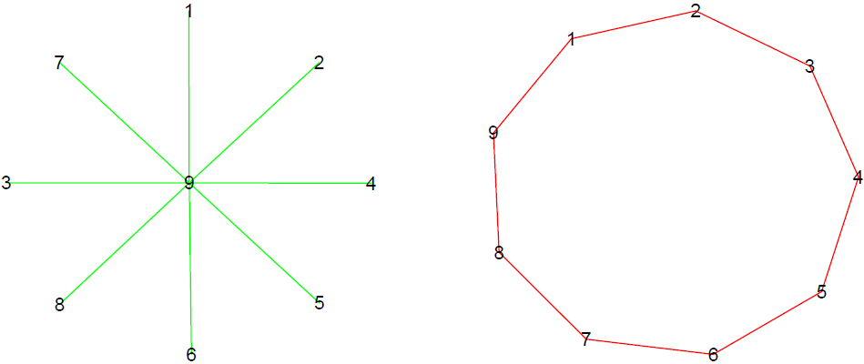
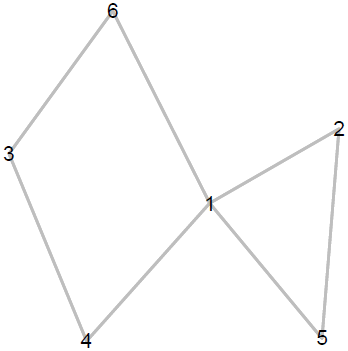

```{r setup, include=FALSE}
knitr::opts_chunk$set(echo = TRUE)
```

1. El grado de un nodo en una red tanto dirigida como no dirigida se puede calcular fácilmente a partir de la matriz de adyacencia $\mathbf{Y}=[y_{i,j}]$. El *out-degree* $d_i^{\text{out}}$ y el *in-degree* $d_i^{\text{in}}$ del nodo $i$ se pueden calcular respectivamente como:
$$
d_i^{\text{out}} = \sum_{j:j\neq i} y_{i,j}
\qquad\text{y}\qquad
d_i^{\text{in}} = \sum_{j:j\neq i} y_{j,i}
$$
Muestre que este cálculo funciona tanto para relaciones dirigidas como no dirigidas. Específicamente, muestre que si la red es no dirigida entonces $d_i^{\text{out}} = d_i^{\text{in}}$.

2. Tanto para redes dirigidas como no dirigidas, se define la media global de las interacciones como
$$
\bar{y}=\frac{1}{n(n-1)}\sum_{i,j:i\neq j} y_{i,j}
$$
donde $\mathbf{Y}=[y_{i,j}]$ es la matriz de adyacencia de la red correspondiente. Tal estadístico corresponde a una descripción muy rudimentaria acerca de la plausibilidad de observar una relación entre dos nodos cualesquiera, dado que no tiene en cuenta la heterogeneidad nodal (algunos nodos son más propensos a enviar/recibir más relaciones).

a. Muestre que para relaciones no dirigidas la media global $\bar{y}$ es igual a la media tanto de la parte triangular superior de $\mathbf{Y}$ como de la parte triangular inferior de $\mathbf{Y}$.
b. Muestre que tanto para relaciones dirigidas como no dirigidas la media global corresponde a la densidad de la red.
b. Muestre que tanto para relaciones dirigidas como no dirigidas se tiene que $(n-1)\bar{y} = \bar{d}^{\text{out}}=\bar{d}^{\text{in}}$. Es decir, el grado promedio tanto de entrada como de salida son iguales y a su vez equivalentes la densidad.

3. Considere un grafo estrella de orden $n$ y un grafo círculo de orden $n$. A continuación se representan ambos grafos para $n=9$. Estos grafos tienen aproximadamente la misma densidad, pero su estructura es muy diferente. Recuerde que la densidad de un grafo se puede calcular como el grado promedio dividido por $n - 1$.

a. Muestre que para el grafo círculo  de orden $n$ el grado promedio es $\bar{d} = 2$.
b. Muestre que para el grafo estrella de orden $n$ el grado promedio es $\bar{d} = 2\frac{n-1}{n} \rightarrow 2$ cuando $n\rightarrow\infty$.

```{r, eval = TRUE, echo=FALSE, out.width="70%", fig.pos = 'H', fig.align = 'center'}

```

4. ¿Cuáles de las siguientes secuencias son caminatas en el grafo que se presenta a continuación? ¿Cuáles senderos? ¿Cuáles circuitos? ¿Cuáles ciclos?

a. $2 - 1 - 6 - 3 - 4$.
b. $2 - 1 - 6 - 3 - 4 - 1 - 5$.
c. $2 - 1 - 2 - 5 - 1 - 4$.
d. $2 - 1 - 6 - 3 - 4$.
e. $2 - 1 - 6 - 3 - 4 - 1 - 5$.
f. $2 - 1 - 2 - 5 - 1 - 4$.
g. $2 - 1 - 6 - 3 - 4$.
h. $2 - 1 - 6 - 3 - 4 - 1 - 5$.
i. $2 - 1 - 2 - 5 - 1 - 4$.

```{r, eval = TRUE, echo=FALSE, out.width="25%", fig.pos = 'H', fig.align = 'center'}

```

5. Considere el conjunto de datos dado en `comtrade.RData` (este archivo contiene una arreglo de cuatro dimensiones denominado `comtrade`), asociado con el crecimiento anual del comercio (diferencia en dólares en escala logarítmica respecto al año 2000). Este conjunto de datos involucra 30 países, 10 años desde 1996 hasta 2005, y 6 clases de productos diferentes, como se muestra a continuación:

```{r}
load("comtrade.RData")
dimnames(comtrade)[c(1,3,4)]
```
a. Calcule el aumento medio global $\bar{y}$ a lo largo de los 10 años en bienes manufacturados. Para ello considere la matriz de adyacencia `Y` dada por:
```{r}
Y <- apply(X = comtrade[,,c(5,6),], MARGIN = c(1,2), FUN = mean)
dim(Y)
round(Y[1:5,1:5], 2)
```

b. Calcule la media de todas las observaciones de cada fila de `Y`, es decir, calcule la media fila $\bar{y}_{i\bullet}=\frac{1}{n-1}\sum_{j:j\neq i} y_{i,j}$ para cada país. Realice una histograma de los promedios fila $\bar{y}_{i\bullet}$. Los promedios fila caracterizan diferentes niveles de actividad de los nodos en términos de la sociabilidad. ¿Cómo se pueden interpretar los promedios fila $\bar{y}_{i\bullet}$?
b. Calcule la media de todas las observaciones de cada columna de `Y`, es decir, calcule la media columna $\bar{y}_{\bullet j}=\frac{1}{n-1}\sum_{i:i\neq j} y_{i,j}$ para cada país. Realice una histograma de los promedios columna $\bar{y}_{\bullet j}$. Los promedios columna caracterizan diferentes niveles de actividad de los nodos en términos de la popularidad. ¿Cómo se pueden interpretar los promedio columna $\bar{y}_{\bullet j}$?
b. Calcule tanto la media de los promedios fila $\bar{y}_{i\bullet}$ como la media de los promedios columna $\bar{y}_{\bullet j}$.
b. Calcule tanto la DE de los promedios fila $\bar{y}_{i\bullet}$ como la DE de los promedios columna $\bar{y}_{\bullet j}$. ¿Qué se puede concluir acerca de la heterogeneidad local en este caso?
b. Calcule el coeficiente de correlación entre los promedios fila $\bar{y}_{i\bullet}$ y los promedios columna $\bar{y}_{\bullet j}$. Realice un dispersograma de los promedios columna $\bar{y}_{\bullet j}$ (eje $y$) frente a los promedios fila $\bar{y}_{i\bullet}$ (eje $x$), junto con la recta $y=x$ como punto de referencia. ¿Qué se puede concluir? 

6.  Considere el conjunto de datos dado en `conflict.RData` recopilado por Mike Ward y Xun Cao del departamento de Ciencias Políticas de la Universidad de Washington, asociado con datos de conflictos entre países en los años 90. El archivo `conflict.RData` contiene una lista con tres arreglos, `X`, `Y`, y `D`. `X` tiene tres campos: `population` (población en millones), `gdp` (PIB en millones de dolares) `polity` (puntuación política, un índice de democracia). `Y` hace referencia a una matriz $\mathbf{Y}=[y_{i,j}]$ en la que $y_{i,j}$ representa el número de conflictos iniciados por el país $i$ hacia el país $j$. Finalmente, `D`es un arreglo de tres dimensiones dimensiones cuya tercera dimensión contiene indices entre cada par de países asociados con: comercio (dimensión 1), importaciones (dimensión 2), organizaciones intergubernamentales (dimensión 3), y distancia geográfica (dimensión 4).

a. Hacer una visualización decorada de la red de conflictos teniendo en cuenta diferentes diseños.
b. Calcule e interprete la media global.
b. Obtenga y grafique la distribución del *out-degree* y del *in-degree*. Calcule e interprete la media y la desviación estándar de esta distribución. 
b. Calcule el coeficiente de correlación entre los valores del *out-degree* y el *in-degree*. Realice un dispersograma de los grados de entrada (eje $y$) frente a los grados de salida (eje $x$), junto con la recta $y=x$ como punto de referencia. ¿Qué se puede concluir?
b. Identifique los países mas activos.


7. Considere los datos relacionales acerca de los conflictos internacionales del archivo `conflict.RData` habiendo removido los nodos aislados:

```{r, fig.width=6, fig.height=6}
# datos
load("conflict.RData")
Y <- dat$Y
# remover nodos aislados
Y <- 1*( Y*t(Y) > 0 )
deg <- apply(X = Y, MARGIN = 1, FUN = sum, na.rm = TRUE)
Y <- Y[deg > 0, deg > 0]
```

a. Hacer una visualización de la red.
b. Identificar las componentes conectadas del grafo.
c. Identificar la componente gigante del grafo.
d. Calcular la matriz de distancias geodésicas de la componente gigante del grafo e incrustar estas distancias en un espacio de dos dimensiones por medio de escalamiento multidimensional (`cmdscale` en `R`).

8. Conseguir una base de datos relacionales de su interés de cualquier área de estudio.

a. ¿De qué se trata la red? ¿A qué corresponden los vértices? ¿Las aristas? 
b. ¿Por qué es interesante estudiar esta red? ¿Qué preguntas se quieren responder?
c. Hacer una visualización tanto simple como decorada de la red.