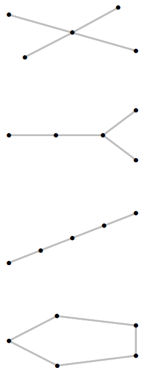

```{r setup, include=FALSE}
knitr::opts_chunk$set(echo = TRUE)
```

1. Para todos los vértices de los cuatro grafos que se presentan a continuación, calcular el grado y las medidas de centralidad. Para cada grafo completar e interpretar la siguiente tabla. Interpretar los resultados.

| Medida | Grado  | Cercanía  | Intermediación | Propia      |
|:------:|:------:|:---------:|:--------------:|:-----------:|
| Media  |        |           |                |             | 
| DE     |        |           |                |             |

```{r, eval = TRUE, echo=FALSE, out.width="25%", fig.pos = 'H', fig.align = 'center'}

```

2. Considere la base de datos relacionales de su interés que reportó en el numeral 8. del Taller 2.

a. Caracterizar completamente la centralidad de los nodos usando todas las medidas de centralidad disponibles.
b. Visualizar la red con un diseño adecuado teniendo en cuenta la centralidad de los nodos. 
c. Identificar los puntos de articulación, los puntos aislados, y las componentes.
c. Hacer la distribución de las distancia geodésica. 
c. Evaluar si la red es libre de escala.
c. Hacer un censo de los clanes y calcular el número clan.
c. Calcular la densidad junto con el coef. de agrupamiento de la red.
c. Interpretar los resultados.

3. Sintetizar y replicar el Cap. 4 de Luke, D. A. (2015).

4. Sintetizar y replicar el Cap. 5 de Luke, D. A. (2015). 

5. Sintetizar y replicar el Cap. 6 de Luke, D. A. (2015). 

6. Sintetizar y replicar la Sec. 7.2.4 y la Sec 7.3 de Luke, D. A. (2015).

7. Sintetizar y replicar la Sec. 8.1 y la Sec 8.2 de Luke, D. A. (2015).


# Referencias {-}

**Luke, D. A. (2015). A user's guide to network analysis in R. New York: Springer.** https://link.springer.com/book/10.1007/978-3-319-23883-8

